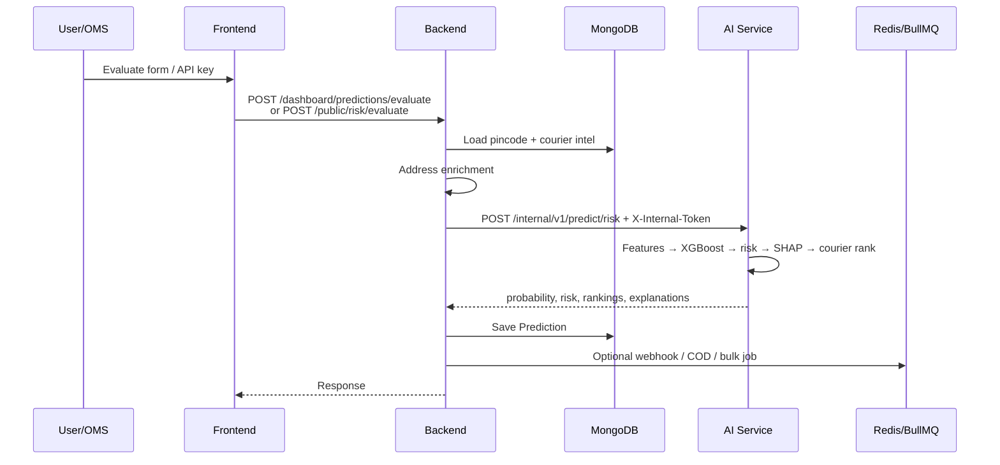

# PredixRoute — Complete Viva / Group Discussion Guide

Use this as your master sheet for final submission group discussion. Teachers usually ask: **what problem**, **how it works**, **why this tech**, **what is AI**, and **limitations**.

---

## 1. One-Minute Pitch (Memorize This)

**PredixRoute** is an **AI-powered logistics intelligence platform**. Before a seller ships, it predicts **delivery success risk**, ranks **couriers**, and explains **why** — via a dashboard or API.

**Problem:** Ecommerce/logistics teams lose money to **RTO (return-to-origin)**, wrong courier choice, and weak COD addresses. Decisions are often gut-feel or static rules.

**Target users:** Logistics companies, shipping aggregators, ecommerce brands, courier providers, OMS/ERP/WMS systems.

**Critical architecture rule:** Frontend **never** talks to the AI service. Flow is always:

```
React → Node API Gateway → MongoDB / Redis → FastAPI AI (XGBoost + SHAP)
```

---

## 2. Monorepo Structure

| Folder | Role |
|--------|------|
| `frontend/` | React + Vite dashboard + marketing site |
| `backend/` | Express/TypeScript API: auth, tenants, orchestration, workers |
| `ai-service/` | Internal FastAPI ML (predict + train) |
| `data/datasets/` | Training CSVs, bootstrap data |
| `infrastructure/` | Docker, nginx, deploy scripts |
| `docs/` | Architecture, training governance, production notes |
| `docker-compose.yml` | Local full stack |

---

## 3. Tech Stack

| Layer | Tech |
|-------|------|
| Frontend | React 18, Vite 5, MUI, TanStack Query, Zustand, Zod |
| Backend | Node ≥20, Express, TypeScript, Mongoose, BullMQ, JWT, Winston |
| AI | Python, FastAPI, XGBoost, scikit-learn, SHAP, pandas, joblib |
| DB | MongoDB 7 |
| Queue/cache | Redis 7 + BullMQ |
| Proxy | Nginx |
| Extra | OpenAI (COD chat), Twilio WhatsApp |
| CI | GitHub Actions |

**Note:** No Prisma — MongoDB with **Mongoose** models under `backend/src/models/`.

---

## 4. End-to-End Prediction Flow



**Backend responsibilities:** enrich input → call AI → save prediction → optional webhook / COD / usage metering.

**AI responsibilities:** build 19 features → `predict_proba` → risk score → SHAP top-5 → weighted courier ranking.

---

## 5. What the AI Actually Predicts

| Item | Answer |
|------|--------|
| Model | **XGBoost binary classifier** (`XGBClassifier`) |
| Target | Will this shipment be **successfully delivered?** (1/0) |
| Output prob | `deliveryProbability` (clamped ~0.01–0.99) |
| Risk score | `(1 - deliveryProbability) × 100` |
| Risk levels | LOW <25, MEDIUM <50, HIGH <75, CRITICAL ≥75 |
| Explainability | **SHAP** TreeExplainer — top features that increase/decrease risk |
| Courier ranking | **Not a second ML model** — weighted heuristic on top of ML probability |

**19 features** (examples to mention in viva):

- `pincode_risk_score`, `pincode_success_rate`, `pincode_rto_rate`
- `cod_flag`, `cod_amount_normalized`, `cod_risk_bucket`
- `order_value_log`, `weight_grams_normalized`, `weight_bucket`, `weight_risk_score`
- `address_quality_score`, `address_risk_score`
- `day_of_week`, `is_weekend`
- Courier aggregate stats (`top_courier_success_rate`, `avg_courier_success_rate`, etc.)

Defined in `ai-service/app/ml/model_registry.py`.

**Courier ranking weights:** success 40%, performance 25%, RTO 15%, SLA 10%, cost 10% + tier bias.

**Second "AI" surface:** COD WhatsApp verification using **OpenAI** for intent (confirm / reject / unclear) — separate from XGBoost.

---

## 6. Core Features

### Marketing Site

| Route | Purpose |
|-------|---------|
| `/` | Home |
| `/features` | Feature list |
| `/pricing` | Pricing |
| `/about` | About |
| `/try` | Demo evaluate (no login) |

### Customer Portal (`/app/*`)

| Route | Purpose |
|-------|---------|
| `/app` | Dashboard |
| `/app/evaluate` | Risk evaluation form |
| `/app/predictions` | Prediction history |
| `/app/predictions/:id` | Prediction detail |
| `/app/pincodes` | Pincode intelligence |
| `/app/api-keys` | API key management |
| `/app/usage` | Usage analytics |
| `/app/settings` | Org settings |
| `/app/webhooks` | Webhook config |
| `/app/cod-verifications` | COD verification list |
| `/app/bulk-predictions` | Bulk CSV/XLSX upload |
| `/app/developers` | API docs for integrators |

### Platform Admin (`/admin/*`)

| Route | Purpose |
|-------|---------|
| `/admin` | Overview |
| `/admin/organizations` | Manage orgs |
| `/admin/users` | Manage users |
| `/admin/system` | System health |
| `/admin/training` | Dataset upload, contribution review, model training |

### Auth APIs (`/api/v1/auth`)

- User/admin register & login
- Email verify, forgot/reset password
- Refresh, logout, me

### Public APIs (`/api/v1/public`) — API key auth

| Method | Path | Purpose |
|--------|------|---------|
| POST | `/public/risk/evaluate` | Single risk evaluation |
| POST | `/public/risk/evaluate-and-verify` | Evaluate + start COD |
| POST | `/public/batch/evaluate` | Batch evaluation |
| POST | `/public/demo/risk/evaluate` | Rate-limited demo |
| GET | `/public/pincode/:pincode` | Pincode intelligence |
| GET | `/public/courier/:courier` | Courier intelligence |
| POST | `/public/cod-verifications/start` | Start COD flow |
| POST | `/public/shipments/outcome` | Report delivery outcome |

### Dashboard APIs (`/api/v1/dashboard`) — JWT + RBAC

- Predictions evaluate/list/detail/batch
- COD list/start/resolve
- Bulk upload/list/download
- Analytics, pincodes, couriers, API keys, webhooks, settings

### Admin APIs (`/api/v1/admin`) — SUPER_ADMIN

- Stats, system health, dataset upload/train
- Contribution approve/reject/merge
- Organizations, users

**Note:** README still says Slice 3/4 "Planned", but code already has bulk, webhooks, COD, and training. Say: *"README is behind; features are implemented in code."*

---

## 7. Backend Deep Dive

**Entry:** `backend/src/server.ts` → `app.ts` → routes under `/api/v1`.

| File | Purpose |
|------|---------|
| `backend/src/server.ts` | Boot Mongo + Redis, listen on PORT |
| `backend/src/app.ts` | Express middleware, routes, swagger |
| `backend/src/routes/index.ts` | Mount auth/public/dashboard/admin/webhooks |
| `backend/src/services/prediction.service.ts` | Evaluate risk, persist, usage, webhooks |
| `backend/src/services/aiOrchestrator.service.ts` | HTTP client to AI with internal token |
| `backend/src/services/bulkPrediction.service.ts` | CSV/XLSX upload → BullMQ job |
| `backend/src/services/codVerification.service.ts` | WhatsApp COD flow |
| `backend/src/services/codVerificationAi.service.ts` | OpenAI intent parsing |
| `backend/src/services/pincode.service.ts` | DB intel or DEFAULT fallbacks |
| `backend/src/services/courier.service.ts` | Courier intel or DEFAULT stats |
| `backend/src/middleware/auth.middleware.ts` | JWT + RBAC roles |
| `backend/src/middleware/apiKeyAuth.middleware.ts` | API keys + scopes |
| `backend/src/utils/addressAnalysis.ts` | Address quality enrichment |
| `backend/src/jobs/worker.ts` | Background worker entry |
| `backend/scripts/seed-dev-data.ts` | Demo org, users, API key, seed data |

**Auth model:**

- Roles: `SUPER_ADMIN` | `ORGANIZATION_ADMIN` | `ANALYST`
- JWT access + refresh tokens
- Redis `revoked:{jti}` for logout
- API keys hashed SHA-256 with scopes

**How backend calls AI:**

`AiOrchestratorService.predictRisk` POSTs to `{AI_SERVICE_URL}/internal/v1/predict/risk` with header `X-Internal-Token`, after loading pincode/courier context.

**If AI is down:** Backend returns `AI_SERVICE_UNAVAILABLE` (503) — does **not** invent a fake risk score.

---

## 8. AI/ML Deep Dive

### Models

- **XGBoost binary classifier** (`XGBClassifier`, n_estimators=120, max_depth=5)
- Artifacts: `ai-service/models/orgs/{organization_id}/risk_classifier.joblib`
- Registry fallback: org model → `global` org

### Inference Pipeline

1. Transform request → feature dict (19 columns)
2. `predict_proba` → `delivery_probability`
3. `risk_score = (1 - delivery_probability) * 100`
4. Classify: LOW / MEDIUM / HIGH / CRITICAL
5. SHAP TreeExplainer top-5 (or heuristic fallback)
6. Weighted courier ranking

### Training / Bootstrap

- Startup: `ensure_bootstrap_models` if `BOOTSTRAP_MODEL_ON_STARTUP=true`
- Dataset: `data/datasets/bootstrap/processed.csv` (~600 labeled rows)
- Generator: `ai-service/scripts/generate_bootstrap_dataset.py` (synthetic labels)
- Admin/API train: `POST /internal/v1/train` (min 100 rows, both classes)

### AI Endpoints (Internal Only)

| Endpoint | Auth |
|----------|------|
| `GET /internal/v1/health` | `X-Internal-Token` |
| `POST /internal/v1/predict/risk` | `X-Internal-Token` |
| `POST /internal/v1/train` | `X-Internal-Token` |

**Honest line for teachers:** *"Bootstrap is for demo/cold start; production accuracy needs real consented delivery outcomes."*

---

## 9. Frontend Deep Dive

- **Stack:** React 18 + Vite + MUI + React Router 6 + TanStack Query + Zustand
- **Entry:** `frontend/src/main.tsx` → `App.tsx` → `frontend/src/routes/index.tsx`
- **API base:** `VITE_API_BASE_URL` → default `http://localhost:3000/api/v1`
- **Paths:** `frontend/src/routes/paths.ts`

**Key UX flows to demo:**

1. Marketing → `/try` → demo risk (no login)
2. Customer login → `/app/evaluate` → risk + SHAP + courier rankings
3. Bulk CSV → `/app/bulk-predictions` → poll job → download
4. Org admin → API keys + Developers docs
5. Settings → training consent → upload contributions
6. Admin login → `/admin/training` → approve merge + train

---

## 10. Database (MongoDB Collections)

| Model | Stores |
|-------|--------|
| Organization | Tenant root, COD + training settings |
| User | Roles, email verify, lockout |
| ApiKey | Hashed keys + scopes |
| ApiPlan / ApiSubscription | Quotas (predictions/day, batch size) |
| Prediction | Input/output/explanations/latency/source |
| PincodePerformance | Per-pincode metrics + courier breakdown |
| CourierPerformance | Per-courier org stats |
| BulkPredictionJob | Async bulk job status |
| CodVerification | WhatsApp conversation state |
| Webhook | Outbound event subscriptions |
| Dataset / TrainingContribution | Training uploads & review |

**Redis uses:** JWT revocation, rate limits, BullMQ job queues.

**Relationships:** Organization 1→N Users, ApiKeys, Predictions, Pincode/CourierPerformance, Webhooks, BulkJobs, CodVerifications, TrainingContributions.

**Training governance (important talking point):** Prediction API logs are **not** automatically training labels. Learning needs **seller outcomes + consent + admin approve/merge** — avoids label leakage from model outputs.

---

## 11. DevOps / Local Run

### Docker Compose Services

| Service | Port |
|---------|------|
| mongodb | 27017 |
| redis | 6379 |
| backend | 3000 |
| worker | (background) |
| ai-service | 8000 |
| frontend | 5173 |
| nginx | 80/443 |

### Key Environment Variables

**Root / Backend:**
- `MONGODB_URI`, `REDIS_URL`
- `JWT_SECRET`, `JWT_REFRESH_SECRET`
- `AI_SERVICE_URL`, `AI_SERVICE_INTERNAL_TOKEN`
- `FRONTEND_URL`
- `OPENAI_API_KEY` (COD)
- Twilio keys (WhatsApp)

**AI Service:**
- `INTERNAL_TOKEN`
- `DATASET_ROOT`
- `BOOTSTRAP_MODEL_ON_STARTUP`
- `MODEL_VERSION`

**Frontend:**
- `VITE_API_BASE_URL`

### How to Run Locally

```powershell
# 1. Start MongoDB + Redis
docker compose up -d mongodb redis

# 2. Backend
cd backend
npm install
npm run seed
npm run dev

# 3. AI Service (separate terminal)
cd ai-service
pip install -r requirements.txt
uvicorn app.main:app --reload --port 8000

# 4. Frontend (separate terminal)
cd frontend
npm install
npm run dev
```

### Demo Credentials (After Seed)

| Portal | Email | Password |
|--------|-------|----------|
| Customer | `admin@demo-logistics.com` | `Demo@123456` |
| Platform admin | `superadmin@predixroute.com` | `Demo@123456` |
| API key | `prx_test_demo_seed_key_for_local_dev_only` | — |

### Test API Call

```powershell
Invoke-RestMethod -Method POST -Uri "http://localhost:3000/api/v1/public/risk/evaluate" `
  -Headers @{ "X-API-Key" = "prx_test_demo_seed_key_for_local_dev_only"; "Content-Type" = "application/json" } `
  -Body '{"destinationPincode":"110001","weightGrams":500,"cod":true,"codAmount":1499,"orderValue":1499,"addressQualityScore":0.72,"availableCouriers":["delhivery","bluedart","dtdc"]}'
```

---

## 12. Architecture Decisions Worth Defending

1. **API gateway pattern** — ML never public; single policy/auth/quota layer.
2. **Service split** — Node for SaaS, Python for ML; scale independently.
3. **Explainable AI (SHAP)** — logistics buyers need "why HIGH risk," not black box.
4. **Multi-tenant SaaS** — org isolation from day one.
5. **Dual product surface** — dashboard for analysts + public API for OMS.
6. **Async bulk via BullMQ** — long CSV jobs don't block HTTP.
7. **Training governance** — don't train on model's own outputs.
8. **Bootstrap for cold start** — demos work without waiting for real datasets.
9. **Address enrichment in backend** before ML — quality score feeds features.
10. **Separate evaluate vs evaluate-and-verify** — risk scoring must not spam WhatsApp by accident.

---

## 13. Honest Limitations (Say These Yourself — Looks Mature)

1. Bootstrap labels are **synthetic**, not real courier MIS data.
2. Marketing numbers on home (e.g. "94% accuracy") are **claims**, not measured from this seed.
3. Few seeded pincodes/couriers; defaults fill gaps.
4. Courier ranking is **heuristic + ML probability**, not a trained ranker.
5. COD/OpenAI/Twilio need real keys or they degrade.
6. Shared/platform model often used for evaluate; per-org model path exists but cold-start is bootstrap/global.
7. README slice table is outdated vs actual features.

---

## 14. Likely Teacher Questions + Answers

### Architecture & Design

**Q: What problem does this solve?**  
A: Predict delivery failure/RTO risk and recommend courier before dispatch.

**Q: Why 3 services?**  
A: Separation of concerns: UI, business API, ML; different languages and scaling needs.

**Q: Why can't frontend call AI directly?**  
A: Security (internal token), auth/quotas, no exposing ML stack publicly.

**Q: Why MongoDB?**  
A: Flexible nested docs for prediction I/O/explanations; multi-tenant indexes.

**Q: Why Redis?**  
A: Sessions/revocation, rate limits, BullMQ job queues.

### Machine Learning

**Q: What algorithm?**  
A: XGBoost binary classifier + SHAP explanations.

**Q: Supervised or unsupervised?**  
A: Supervised classification on labeled delivery success.

**Q: How is risk calculated?**  
A: `risk = (1 − P(delivery)) × 100`, then bucketed into LOW/MEDIUM/HIGH/CRITICAL.

**Q: Explainability?**  
A: SHAP feature impacts; fallback heuristic text if SHAP empty.

**Q: Is courier recommendation ML?**  
A: Partially — ML gives delivery probability; ranking is weighted formula.

**Q: Training data source?**  
A: Consented outcome uploads + admin merge; not raw prediction logs. Bootstrap CSV for cold start.

**Q: Accuracy claim?**  
A: Be honest — bootstrap is synthetic; real metrics need production outcomes.

### Security & Multi-Tenancy

**Q: How multi-tenant?**  
A: `organizationId` on documents + JWT/API key scoping.

**Q: Auth mechanisms?**  
A: JWT (dashboard) + hashed API keys with scopes (public API) + RBAC.

**Q: Security of AI?**  
A: Internal network + `X-Internal-Token`; not in public routes.

### Features & Operations

**Q: Bulk predictions how?**  
A: Upload CSV/XLSX → job document QUEUED → BullMQ worker processes rows → download results.

**Q: What if AI is down?**  
A: 503 / unavailable — no silent fake score from backend.

**Q: COD feature?**  
A: WhatsApp verification via Twilio; OpenAI parses reply intent.

**Q: Scalability?**  
A: Stateless API + workers; AI scalable separately; Mongo/Redis horizontal path documented as future.

**Q: Your contribution / modules?**  
A: Prepare what *your* team member built (FE / BE / AI / docs) — teachers always ask this.

---

## 15. 2-Minute Demo Script

1. Open `/try` or login customer → `/app/evaluate`.
2. Evaluate pincode `110001`, COD on, weight 500g → show risk + SHAP + couriers.
3. Same with rural pincode (e.g. `845401`) or worse address → risk rises.
4. Show prediction history.
5. Mention API key path for OMS integration.
6. (Optional) Admin training page + bootstrap story.
7. Close with architecture: FE → BE → AI → Mongo/Redis.

**Good demo comparison:** pincode `110001` (metro) vs `845401` (higher risk), toggle COD on/off.

---

## 16. Team Role Cheat Sheet (Fill Before Viva)

| Area | Team Member | One Sentence |
|------|-------------|--------------|
| Frontend UI | ___________ | ___________ |
| Backend APIs / auth | ___________ | ___________ |
| AI / ML / SHAP | ___________ | ___________ |
| DB / seed / Docker | ___________ | ___________ |
| Docs / testing | ___________ | ___________ |

---

## 17. Bottom Line (Closing Statement)

PredixRoute is a **multi-tenant logistics SaaS** that scores shipment risk with **XGBoost**, explains decisions with **SHAP**, ranks couriers with a **weighted formula**, and exposes everything through a **Node gateway** so the ML service stays internal and secure.

---

*Generated for PredixRoute final submission group discussion.*
