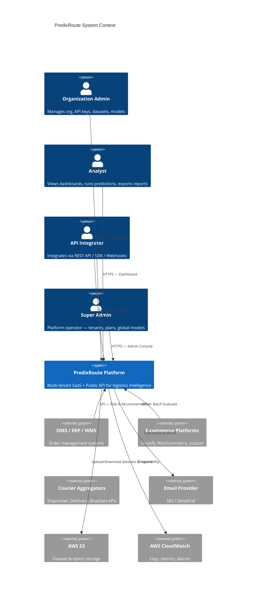
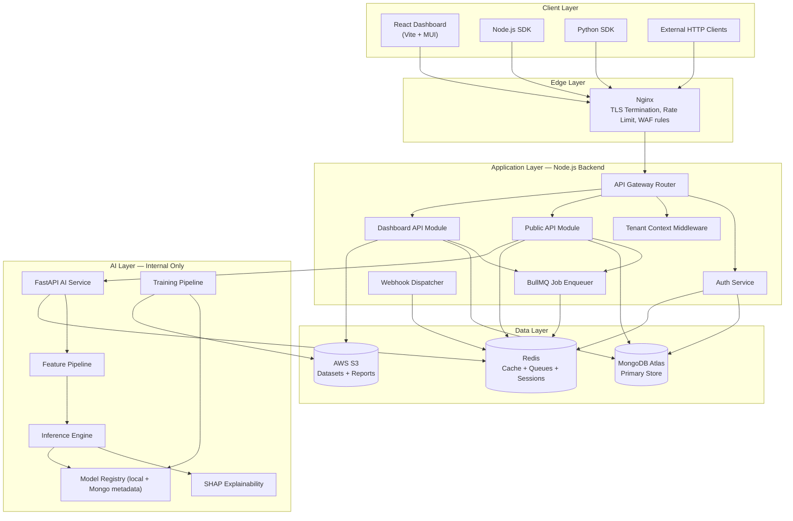
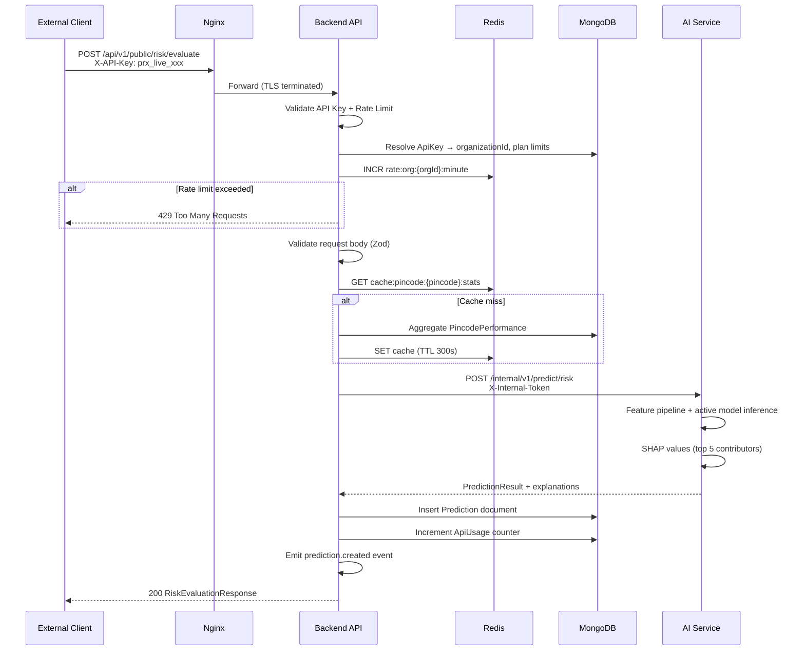
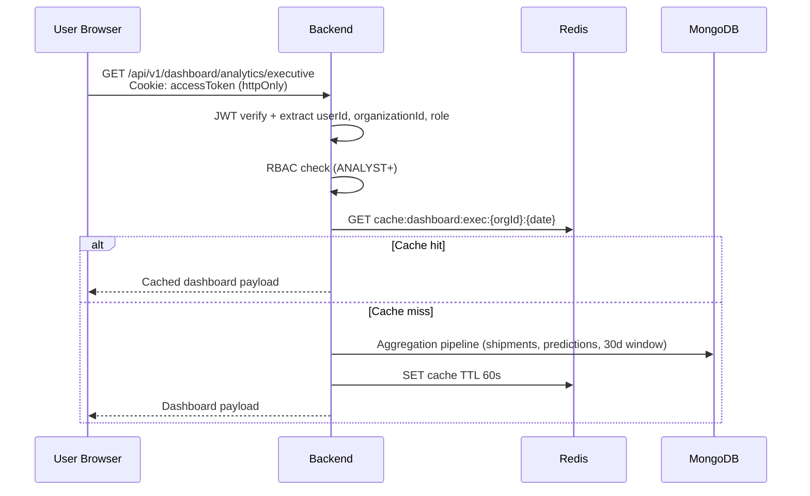
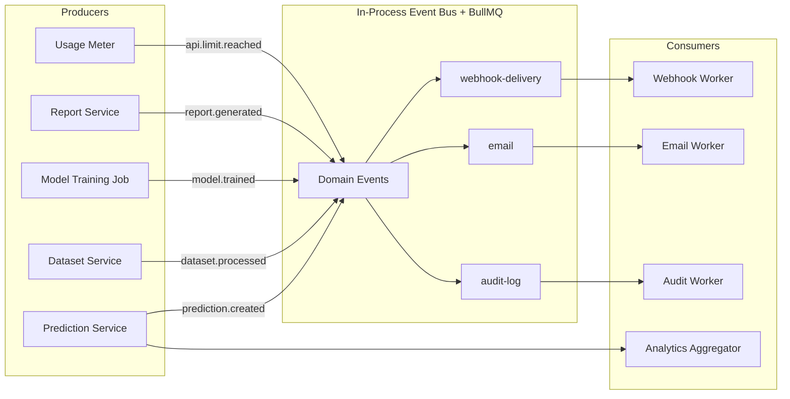
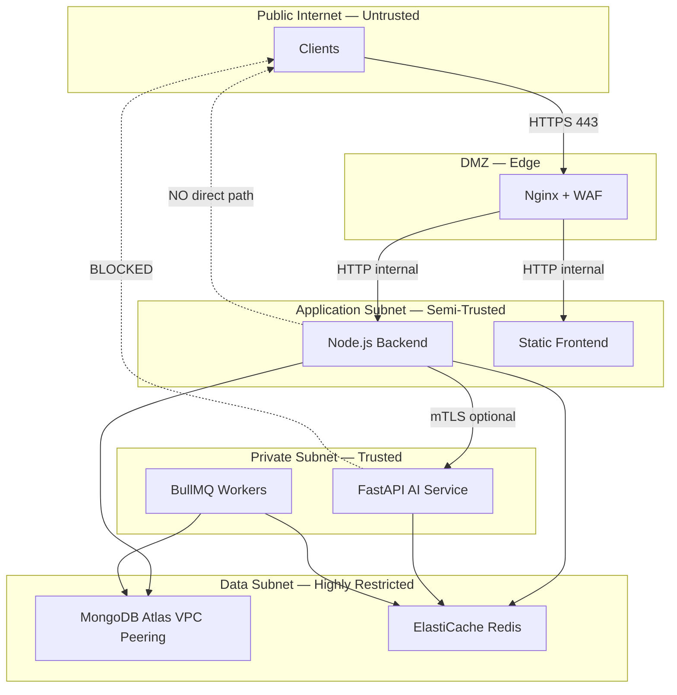
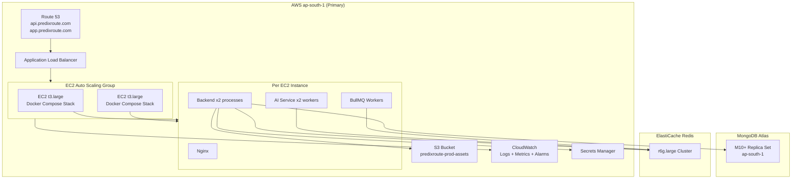
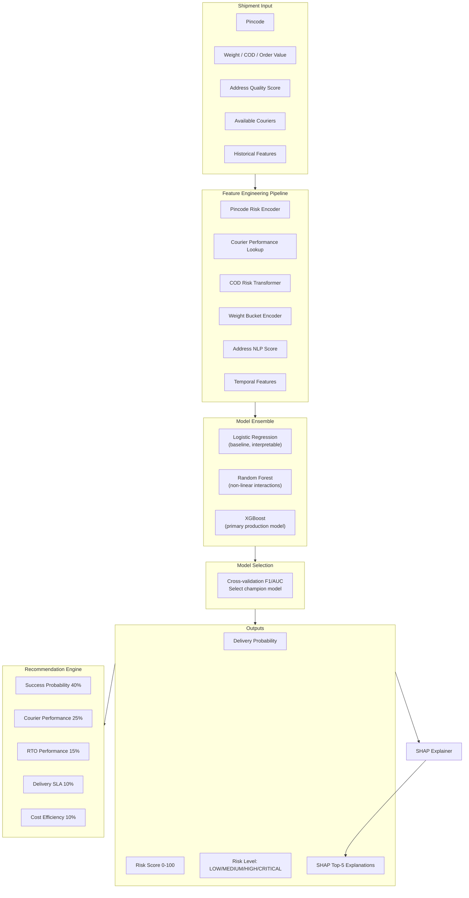

# Phase 1 — Complete High-Level Architecture

## 1.1 System Context Diagram



## 1.2 Service Architecture



### Service Responsibilities

| Service | Responsibility | Scaling Unit |
|---------|---------------|--------------|
| **Nginx** | TLS, reverse proxy, static assets, request size limits | Horizontal (ALB + EC2) |
| **Backend (Express)** | Auth, RBAC, tenant isolation, API orchestration, webhooks, job enqueue | Horizontal (stateless) |
| **AI Service (FastAPI)** | Feature engineering, inference, training, SHAP | Horizontal (GPU optional for training) |
| **MongoDB Atlas** | Multi-tenant document store, analytics aggregations | Sharded cluster (orgId shard key candidate) |
| **Redis** | Session store, rate limit counters, BullMQ, hot cache | Cluster mode |
| **S3** | Immutable dataset versions, generated reports | Bucket per env |

### Architecture Decision Records

**ADR-001: Monolith-first Backend with Extractable Modules**
- *Decision:* Single Express monolith with bounded modules (`auth`, `public-api`, `dashboard`, `webhooks`, `jobs`).
- *Rationale:* Faster time-to-market; clear module boundaries enable future extraction to microservices.
- *Trade-off:* Shared deployment blast radius vs. operational simplicity.

**ADR-002: Internal AI Service (No Direct Client Access)**
- *Decision:* FastAPI service on private network; only backend holds service credentials.
- *Rationale:* Security boundary, centralized auth/billing/rate-limiting, consistent audit trail.
- *Trade-off:* Extra network hop (~5–15ms) vs. security and governance.

**ADR-003: MongoDB over PostgreSQL**
- *Decision:* MongoDB for flexible shipment/prediction schemas and aggregation pipelines.
- *Rationale:* Document model fits nested courier lists, SHAP feature vectors, dataset metadata.
- *Trade-off:* Complex joins replaced by denormalization + aggregation pipelines.

## 1.3 Request Flow

### Public API — Risk Evaluation



### Dashboard — Authenticated Request



## 1.4 Event Flow



### Event Catalog

| Event | Payload | Consumers |
|-------|---------|-----------|
| `prediction.created` | `{ predictionId, organizationId, riskLevel, shipmentRef }` | Webhooks, Analytics |
| `model.trained` | `{ modelId, version, metrics, organizationId }` | Webhooks, Notification |
| `dataset.processed` | `{ datasetId, rowCount, qualityScore }` | Webhooks, Training scheduler |
| `report.generated` | `{ reportId, format, s3Key }` | Webhooks, Email |
| `api.limit.reached` | `{ organizationId, planId, limitType }` | Webhooks, Email, Billing |

## 1.5 Security Boundaries



### Security Zones

| Zone | Trust Level | Controls |
|------|-------------|----------|
| **Public API** | Untrusted | API key auth, rate limits, input validation, no PII in logs |
| **Dashboard API** | Authenticated users | JWT + RBAC + CSRF + httpOnly cookies |
| **Internal AI** | Service-to-service | Internal JWT / mTLS, network ACL, no public DNS |
| **Data** | Highest | Encryption at rest (AES-256), TLS in transit, IP allowlist |

## 1.6 Multi-Tenant Strategy

### Tenant Isolation Model: **Shared Database, Shared Schema, Discriminator Column**

Every collection document includes `organizationId: ObjectId` (required, indexed).

```typescript
// Enforced at repository layer — NEVER optional
interface TenantDocument {
  organizationId: Types.ObjectId;
}
```

### Isolation Layers

1. **Repository Layer:** All queries inject `{ organizationId }` via `TenantScopedRepository` base class.
2. **Middleware Layer:** `tenantContextMiddleware` extracts `organizationId` from JWT or API key and attaches to `req.tenant`.
3. **Super Admin Bypass:** `SUPER_ADMIN` role uses explicit `?organizationId=` for cross-tenant ops; all bypasses audit-logged.
4. **API Keys:** Scoped to single organization; key hash stored, prefix `prx_live_` / `prx_test_`.

### Tenant Lifecycle

```
REGISTER → EMAIL_VERIFY → CREATE_ORG → SELECT_PLAN → ACTIVE
                                              ↓
                                    SUSPENDED (billing)
                                              ↓
                                    DELETED (soft, 30d retention)
```

### Resource Quotas (per plan)

| Resource | Starter | Growth | Enterprise |
|----------|---------|--------|------------|
| API calls/month | 10,000 | 100,000 | Unlimited |
| Predictions/day | 500 | 5,000 | Custom |
| Datasets | 3 | 20 | Unlimited |
| Webhooks | 2 | 10 | Unlimited |
| Users | 3 | 15 | Unlimited |

## 1.7 Deployment Architecture



### Environment Matrix

| Environment | Purpose | Infrastructure |
|-------------|---------|----------------|
| **dev** | Local Docker Compose | MongoDB + Redis containers |
| **staging** | Pre-prod validation | Single EC2, Atlas M10, shared Redis |
| **production** | Live traffic | ASG 2–10 EC2, Atlas M30+, Redis Cluster |

### High Availability

- **Backend:** Stateless; 2+ instances behind ALB; health check `/api/v1/health`
- **AI Service:** 2+ instances; circuit breaker in backend (opossum)
- **MongoDB:** 3-node replica set; automatic failover
- **Redis:** Cluster mode with replica; BullMQ job persistence via AOF
- **RTO:** 15 minutes | **RPO:** 1 hour (Atlas continuous backup)

## 1.8 AI Architecture



### AI Service Internal Endpoints (NOT public)

| Endpoint | Method | Purpose |
|----------|--------|---------|
| `/internal/v1/predict/risk` | POST | Single shipment risk prediction |
| `/internal/v1/predict/batch` | POST | Batch predictions (max 100) |
| `/internal/v1/recommend/courier` | POST | Courier ranking |
| `/internal/v1/explain/shap` | POST | SHAP explanation generation |
| `/internal/v1/train/start` | POST | Trigger training pipeline |
| `/internal/v1/models/activate` | POST | Activate model version |
| `/internal/v1/health` | GET | AI service health |

### Model Lifecycle

```
DATASET_UPLOAD → VALIDATE → FEATURE_ENGINEER → TRAIN(LR,RF,XGB)
      → EVALUATE → SELECT_BEST → REGISTER → STAGING → ACTIVATE → MONITOR
                                                      ↓
                                                  ROLLBACK (if drift detected)
```

### ML Infrastructure Decisions

**ADR-004: Champion/Challenger Model Strategy**
- Production always serves the `ACTIVE` model from registry.
- New models enter `STAGING`; A/B shadow predictions optional before activation.

**ADR-005: Feature Store (Phase 1: Embedded)**
- Pincode/Courier performance cached in Redis (TTL 5 min) and pre-computed in MongoDB aggregations.
- Future: extract to dedicated feature store (Feast/Tecton).

**ADR-006: Training on Backend-Triggered Jobs**
- Training initiated via dashboard → Backend enqueues BullMQ job → Job calls AI service `/train/start`.
- Training artifacts stored in S3; metadata in MongoDB `Models` collection.
