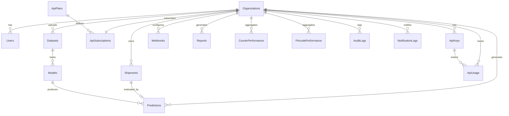

# Phase 3 — Database Design

## Design Principles

1. **Every document** includes `organizationId: ObjectId` (required, indexed).
2. **Soft deletes** via `deletedAt: Date | null` on user-facing entities.
3. **Timestamps** via Mongoose `{ timestamps: true }` → `createdAt`, `updatedAt`.
4. **Tenant isolation** enforced at repository layer — compound indexes lead with `organizationId`.
5. **UUID external IDs** via `publicId: string` (nanoid) for API exposure; never expose MongoDB `_id` in public APIs.

---

## Indexing Strategy (Global)

| Pattern | Index | Purpose |
|---------|-------|---------|
| Tenant lookup | `{ organizationId: 1 }` | Base tenant filter on every collection |
| Tenant + time | `{ organizationId: 1, createdAt: -1 }` | Paginated lists |
| Tenant + status | `{ organizationId: 1, status: 1 }` | Filtered queries |
| Unique within tenant | `{ organizationId: 1, field: 1 }` unique | Scoped uniqueness |
| API key lookup | `{ keyHash: 1 }` unique | Auth (global, not tenant-scoped) |
| Public ID | `{ publicId: 1 }` unique sparse | External references |
| TTL | `{ expiresAt: 1 }` expireAfterSeconds | Sessions, temp tokens |
| Text search | `{ organizationId: 1, name: 'text' }` | Search within tenant |

**Shard Key Candidate (future):** `{ organizationId: 1, _id: 1 }` — co-locates tenant data.

---

## 1. Organizations

```typescript
interface IOrganization {
  _id: ObjectId;
  publicId: string;                    // org_xxxxxxxx
  name: string;                        // max 200, required
  slug: string;                        // unique globally, lowercase
  industry: 'LOGISTICS' | 'ECOMMERCE' | 'AGGREGATOR' | 'COURIER' | 'OMS' | 'OTHER';
  status: 'PENDING' | 'ACTIVE' | 'SUSPENDED' | 'DELETED';
  billingEmail: string;
  settings: {
    timezone: string;                  // IANA, default 'Asia/Kolkata'
    defaultCurrency: 'INR' | 'USD';
    webhookRetryPolicy: { maxAttempts: number; backoffMs: number };
    dataRetentionDays: number;         // default 365
  };
  metadata: Record<string, string>;
  deletedAt: Date | null;
  createdAt: Date;
  updatedAt: Date;
}
```

**Indexes:**
```javascript
{ slug: 1 }                           // unique
{ publicId: 1 }                       // unique
{ status: 1, createdAt: -1 }        // admin queries
```

**Validation:**
- `name`: min 2, max 200 chars
- `slug`: `/^[a-z0-9-]{3,50}$/`, unique
- `billingEmail`: valid email

**Relationships:** 1:N → Users, ApiKeys, Shipments, Predictions, Datasets, Models, Webhooks

**Tenant Strategy:** Root entity — `organizationId` equals `_id` on child documents.

---

## 2. Users

```typescript
interface IUser {
  _id: ObjectId;
  organizationId: ObjectId;            // required, indexed
  publicId: string;                    // usr_xxxxxxxx
  email: string;                       // unique per organizationId
  passwordHash: string;                // bcrypt, cost 12
  firstName: string;
  lastName: string;
  role: 'SUPER_ADMIN' | 'ORGANIZATION_ADMIN' | 'ANALYST';
  status: 'PENDING_VERIFICATION' | 'ACTIVE' | 'LOCKED' | 'DEACTIVATED';
  emailVerified: boolean;
  emailVerificationToken: string | null;
  emailVerificationExpires: Date | null;
  passwordResetToken: string | null;
  passwordResetExpires: Date | null;
  failedLoginAttempts: number;         // default 0
  lockedUntil: Date | null;
  lastLoginAt: Date | null;
  lastLoginIp: string | null;
  loginHistory: Array<{
    ip: string;
    userAgent: string;
    timestamp: Date;
    success: boolean;
  }>;                                  // capped at 50 entries
  preferences: {
    theme: 'light' | 'dark' | 'system';
    notifications: { email: boolean; webhook: boolean };
  };
  deletedAt: Date | null;
  createdAt: Date;
  updatedAt: Date;
}
```

**Indexes:**
```javascript
{ organizationId: 1, email: 1 }                    // unique
{ organizationId: 1, role: 1, status: 1 }
{ organizationId: 1, createdAt: -1 }
{ emailVerificationToken: 1 }                      // sparse
{ passwordResetToken: 1 }                          // sparse
{ role: 1 }                                        // SUPER_ADMIN queries
```

**Validation:**
- Password: min 8 chars, 1 upper, 1 lower, 1 digit, 1 special
- Email: RFC 5322 compliant, lowercase stored
- `loginHistory`: max 50 items (FIFO on insert)

---

## 3. ApiKeys

```typescript
interface IApiKey {
  _id: ObjectId;
  organizationId: ObjectId;
  publicId: string;                    // key_xxxxxxxx
  name: string;                        // user-defined label
  keyPrefix: string;                   // prx_live_abc or prx_test_xyz (first 12 chars)
  keyHash: string;                     // SHA-256 of full key
  environment: 'LIVE' | 'TEST';
  scopes: Array<'risk:evaluate' | 'recommendation' | 'batch' | 'pincode:read' | 'courier:read'>;
  status: 'ACTIVE' | 'REVOKED' | 'EXPIRED';
  rateLimitOverride: number | null;    // requests/minute, null = plan default
  lastUsedAt: Date | null;
  expiresAt: Date | null;
  createdBy: ObjectId;                 // User ref
  revokedAt: Date | null;
  revokedBy: ObjectId | null;
  createdAt: Date;
  updatedAt: Date;
}
```

**Indexes:**
```javascript
{ keyHash: 1 }                                       // unique, auth lookup
{ organizationId: 1, status: 1 }
{ organizationId: 1, environment: 1 }
{ keyPrefix: 1 }                                     // display lookup
```

**Validation:**
- Key generated once: `prx_{env}_{32_random_chars}`; only hash stored
- Scopes must be subset of plan-allowed scopes

---

## 4. ApiUsage

```typescript
interface IApiUsage {
  _id: ObjectId;
  organizationId: ObjectId;
  apiKeyId: ObjectId;
  period: string;                      // '2026-06' (monthly) or '2026-06-10' (daily)
  periodType: 'DAILY' | 'MONTHLY';
  endpoint: string;                    // '/public/risk/evaluate'
  method: 'GET' | 'POST';
  count: number;
  successCount: number;
  errorCount: number;
  totalLatencyMs: number;
  createdAt: Date;
  updatedAt: Date;
}
```

**Indexes:**
```javascript
{ organizationId: 1, period: 1, periodType: 1, endpoint: 1 }  // unique compound
{ organizationId: 1, period: -1 }
{ apiKeyId: 1, period: -1 }
```

**Write Pattern:** Upsert + `$inc` on each API call (atomic).

---

## 5. ApiPlans

```typescript
interface IApiPlan {
  _id: ObjectId;
  publicId: string;
  name: string;                        // 'Starter', 'Growth', 'Enterprise'
  slug: string;                        // unique globally
  priceMonthlyINR: number;
  priceYearlyINR: number;
  limits: {
    apiCallsPerMonth: number;          // -1 = unlimited
    predictionsPerDay: number;
    batchSizeMax: number;              // max items per batch request
    datasetsMax: number;
    webhooksMax: number;
    usersMax: number;
    rateLimitPerMinute: number;
  };
  allowedScopes: string[];
  features: string[];                  // ['shap_explanations', 'scheduled_reports', ...]
  isActive: boolean;
  sortOrder: number;
  createdAt: Date;
  updatedAt: Date;
}
```

**Indexes:**
```javascript
{ slug: 1 }                          // unique
{ isActive: 1, sortOrder: 1 }
```

**Tenant Strategy:** Global catalog — no `organizationId`. Referenced by ApiSubscriptions.

---

## 6. ApiSubscriptions

```typescript
interface IApiSubscription {
  _id: ObjectId;
  organizationId: ObjectId;
  planId: ObjectId;                    // ref ApiPlans
  status: 'TRIAL' | 'ACTIVE' | 'PAST_DUE' | 'CANCELLED' | 'EXPIRED';
  billingCycle: 'MONTHLY' | 'YEARLY';
  currentPeriodStart: Date;
  currentPeriodEnd: Date;
  trialEndsAt: Date | null;
  cancelledAt: Date | null;
  usageSnapshot: {
    apiCallsThisMonth: number;
    predictionsToday: number;
  };
  createdAt: Date;
  updatedAt: Date;
}
```

**Indexes:**
```javascript
{ organizationId: 1 }                // unique (one active sub per org)
{ organizationId: 1, status: 1 }
{ currentPeriodEnd: 1, status: 1 }   // billing cron
```

---

## 7. Shipments

```typescript
interface IShipment {
  _id: ObjectId;
  organizationId: ObjectId;
  publicId: string;                    // shp_xxxxxxxx
  externalRef: string | null;          // client's order ID
  originPincode: string;               // 6-digit IN pincode
  destinationPincode: string;
  weightGrams: number;                 // min 1, max 50000
  cod: boolean;
  codAmount: number | null;            // required if cod=true
  orderValue: number;                  // INR
  addressQualityScore: number;         // 0.0–1.0
  addressLine1: string | null;
  city: string | null;
  state: string | null;
  availableCouriers: string[];         // ['delhivery', 'bluedart', 'dtdc']
  selectedCourier: string | null;
  status: 'PENDING' | 'EVALUATED' | 'SHIPPED' | 'DELIVERED' | 'RTO' | 'CANCELLED';
  metadata: Record<string, unknown>;
  deletedAt: Date | null;
  createdAt: Date;
  updatedAt: Date;
}
```

**Indexes:**
```javascript
{ organizationId: 1, createdAt: -1 }
{ organizationId: 1, status: 1, createdAt: -1 }
{ organizationId: 1, externalRef: 1 }              // sparse unique
{ organizationId: 1, destinationPincode: 1 }
{ organizationId: 1, selectedCourier: 1 }
{ publicId: 1 }                                      // unique
```

**Validation:**
- Pincodes: `/^\d{6}$/`
- `codAmount`: required when `cod === true`, min 1
- `addressQualityScore`: 0–1 inclusive

---

## 8. Predictions

```typescript
interface IPrediction {
  _id: ObjectId;
  organizationId: ObjectId;
  publicId: string;                    // prd_xxxxxxxx
  shipmentId: ObjectId | null;
  modelId: ObjectId;
  modelVersion: string;
  input: {
    destinationPincode: string;
    weightGrams: number;
    cod: boolean;
    codAmount: number | null;
    orderValue: number;
    addressQualityScore: number;
    availableCouriers: string[];
  };
  output: {
    deliveryProbability: number;       // 0.0–1.0
    riskScore: number;                 // 0–100
    riskLevel: 'LOW' | 'MEDIUM' | 'HIGH' | 'CRITICAL';
    recommendedCourier: string | null;
    courierRankings: Array<{
      courier: string;
      score: number;
      successProbability: number;
      breakdown: {
        successWeight: number;
        performanceWeight: number;
        rtoWeight: number;
        slaWeight: number;
        costWeight: number;
      };
    }>;
  };
  explanations: Array<{
    feature: string;
    value: number | string;
    impact: number;                    // SHAP value
    direction: 'INCREASES_RISK' | 'DECREASES_RISK';
    description: string;
  }>;
  source: 'DASHBOARD' | 'PUBLIC_API' | 'BATCH';
  apiKeyId: ObjectId | null;
  latencyMs: number;
  createdAt: Date;
}
```

**Indexes:**
```javascript
{ organizationId: 1, createdAt: -1 }
{ organizationId: 1, 'output.riskLevel': 1, createdAt: -1 }
{ organizationId: 1, shipmentId: 1 }               // sparse
{ organizationId: 1, source: 1, createdAt: -1 }
{ publicId: 1 }                                      // unique
{ createdAt: 1 }                                     // TTL optional for raw predictions
```

---

## 9. CourierPerformance

```typescript
interface ICourierPerformance {
  _id: ObjectId;
  organizationId: ObjectId;            // org-specific OR global (organizationId = platform org)
  courierCode: string;                 // 'delhivery', 'bluedart'
  courierName: string;
  period: string;                      // '2026-06' or 'ALL_TIME'
  metrics: {
    totalShipments: number;
    delivered: number;
    rto: number;
    successRate: number;               // delivered / total
    rtoRate: number;
    avgDeliveryDays: number;
    p90DeliveryDays: number;
    codSuccessRate: number;
    avgCostPerKg: number;
  };
  trend: Array<{
    period: string;
    successRate: number;
    rtoRate: number;
    avgDeliveryDays: number;
  }>;
  topPincodes: Array<{ pincode: string; successRate: number }>;
  worstPincodes: Array<{ pincode: string; successRate: number }>;
  lastComputedAt: Date;
  createdAt: Date;
  updatedAt: Date;
}
```

**Indexes:**
```javascript
{ organizationId: 1, courierCode: 1, period: 1 }     // unique
{ organizationId: 1, 'metrics.successRate': -1 }
{ courierCode: 1, period: 1 }                        // global lookups
```

---

## 10. PincodePerformance

```typescript
interface IPincodePerformance {
  _id: ObjectId;
  organizationId: ObjectId;
  pincode: string;                     // 6-digit
  state: string;
  city: string;
  tier: 'METRO' | 'TIER1' | 'TIER2' | 'TIER3' | 'RURAL';
  period: string;
  metrics: {
    totalShipments: number;
    successRate: number;
    rtoRate: number;
    avgDeliveryDays: number;
    riskScore: number;                 // 0–100 computed
    codRiskScore: number;
  };
  courierBreakdown: Array<{
    courierCode: string;
    successRate: number;
    rtoRate: number;
    avgDeliveryDays: number;
    shipmentCount: number;
  }>;
  bestCourier: string | null;
  worstCourier: string | null;
  trend: Array<{ period: string; successRate: number; riskScore: number }>;
  lastComputedAt: Date;
  createdAt: Date;
  updatedAt: Date;
}
```

**Indexes:**
```javascript
{ organizationId: 1, pincode: 1, period: 1 }         // unique
{ organizationId: 1, 'metrics.riskScore': -1 }
{ pincode: 1 }                                       // public API lookup
{ organizationId: 1, tier: 1, 'metrics.riskScore': -1 }
```

---

## 11. Datasets

```typescript
interface IDataset {
  _id: ObjectId;
  organizationId: ObjectId;
  publicId: string;
  name: string;
  description: string | null;
  version: number;                     // auto-increment per name
  status: 'UPLOADING' | 'VALIDATING' | 'PROCESSING' | 'READY' | 'FAILED' | 'ARCHIVED';
  s3Key: string;                       // datasets/{orgId}/{datasetId}/v{version}/raw.csv
  s3ProcessedKey: string | null;
  fileName: string;
  fileSizeBytes: number;
  mimeType: 'text/csv';
  rowCount: number | null;
  columnCount: number | null;
  schema: Array<{
    name: string;
    detectedType: 'STRING' | 'NUMBER' | 'BOOLEAN' | 'DATE';
    mappedField: string | null;        // maps to feature name
    nullPercentage: number;
    sampleValues: string[];
  }>;
  qualityReport: {
    overallScore: number;              // 0–100
    missingValues: number;
    duplicates: number;
    outliers: number;
    invalidPincodes: number;
    issues: Array<{ severity: 'ERROR' | 'WARNING'; message: string; row?: number }>;
  } | null;
  columnMapping: Record<string, string>;
  processingJobId: string | null;
  errorMessage: string | null;
  createdBy: ObjectId;
  deletedAt: Date | null;
  createdAt: Date;
  updatedAt: Date;
}
```

**Indexes:**
```javascript
{ organizationId: 1, createdAt: -1 }
{ organizationId: 1, status: 1 }
{ organizationId: 1, name: 1, version: -1 }
{ publicId: 1 }                                      // unique
```

---

## 12. Models

```typescript
interface IModel {
  _id: ObjectId;
  organizationId: ObjectId;
  publicId: string;
  name: string;
  type: 'RISK_PREDICTION' | 'COURIER_RANKING';
  algorithm: 'LOGISTIC_REGRESSION' | 'RANDOM_FOREST' | 'XGBOOST';
  version: string;                     // semver: '1.2.0'
  status: 'TRAINING' | 'STAGING' | 'ACTIVE' | 'ARCHIVED' | 'FAILED';
  datasetId: ObjectId;
  s3ArtifactKey: string;               // models/{orgId}/{modelId}/v{version}/model.joblib
  featureNames: string[];
  hyperparameters: Record<string, unknown>;
  metrics: {
    accuracy: number;
    precision: number;
    recall: number;
    f1Score: number;
    aucRoc: number;
    confusionMatrix: number[][];
    crossValidationScores: number[];
  };
  comparison: {
    previousVersion: string | null;
    improvementPercent: number | null;
  };
  trainedAt: Date | null;
  activatedAt: Date | null;
  activatedBy: ObjectId | null;
  trainingJobId: string | null;
  errorMessage: string | null;
  createdBy: ObjectId;
  createdAt: Date;
  updatedAt: Date;
}
```

**Indexes:**
```javascript
{ organizationId: 1, type: 1, status: 1 }
{ organizationId: 1, name: 1, version: -1 }
{ organizationId: 1, type: 1, status: 1 }            // find ACTIVE model
{ publicId: 1 }                                      // unique
```

**Constraint:** Only one `ACTIVE` model per `{ organizationId, type }` — enforced in service layer with transaction.

---

## 13. Webhooks

```typescript
interface IWebhook {
  _id: ObjectId;
  organizationId: ObjectId;
  publicId: string;
  name: string;
  url: string;                         // HTTPS only in production
  secret: string;                      // whsec_xxx for HMAC-SHA256 signing
  events: Array<'prediction.created' | 'model.trained' | 'dataset.processed' | 'report.generated' | 'api.limit.reached'>;
  status: 'ACTIVE' | 'DISABLED' | 'FAILING';
  headers: Record<string, string>;     // custom headers
  consecutiveFailures: number;
  lastTriggeredAt: Date | null;
  lastSuccessAt: Date | null;
  createdBy: ObjectId;
  createdAt: Date;
  updatedAt: Date;
}
```

**Indexes:**
```javascript
{ organizationId: 1, status: 1 }
{ organizationId: 1, events: 1 }
{ publicId: 1 }
```

---

## 14. Reports

```typescript
interface IReport {
  _id: ObjectId;
  organizationId: ObjectId;
  publicId: string;
  name: string;
  type: 'RISK_SUMMARY' | 'COURIER_PERFORMANCE' | 'PINCODE_ANALYSIS' | 'API_USAGE' | 'MODEL_PERFORMANCE' | 'CUSTOM';
  format: 'PDF' | 'XLSX' | 'CSV';
  status: 'QUEUED' | 'GENERATING' | 'COMPLETED' | 'FAILED';
  schedule: {
    enabled: boolean;
    cron: string | null;               // '0 9 * * 1' = Monday 9am
    timezone: string;
    nextRunAt: Date | null;
  } | null;
  filters: {
    dateFrom: Date;
    dateTo: Date;
    riskLevels?: string[];
    couriers?: string[];
    pincodes?: string[];
  };
  s3Key: string | null;
  fileSizeBytes: number | null;
  generatedAt: Date | null;
  expiresAt: Date | null;              // S3 lifecycle
  errorMessage: string | null;
  createdBy: ObjectId;
  createdAt: Date;
  updatedAt: Date;
}
```

**Indexes:**
```javascript
{ organizationId: 1, createdAt: -1 }
{ organizationId: 1, status: 1 }
{ 'schedule.enabled': 1, 'schedule.nextRunAt': 1 }  // scheduler cron
{ publicId: 1 }
```

---

## 15. AuditLogs

```typescript
interface IAuditLog {
  _id: ObjectId;
  organizationId: ObjectId;
  userId: ObjectId | null;
  apiKeyId: ObjectId | null;
  action: string;                      // 'USER.LOGIN', 'API_KEY.CREATED', 'MODEL.ACTIVATED'
  resource: string;                    // 'User', 'Model', 'ApiKey'
  resourceId: string;
  changes: { before: Record<string, unknown>; after: Record<string, unknown> } | null;
  ip: string;
  userAgent: string;
  requestId: string;
  metadata: Record<string, unknown>;
  createdAt: Date;
}
```

**Indexes:**
```javascript
{ organizationId: 1, createdAt: -1 }
{ organizationId: 1, action: 1, createdAt: -1 }
{ organizationId: 1, userId: 1, createdAt: -1 }
{ createdAt: 1 }                                     // TTL: expireAfterSeconds 7776000 (90d)
```

**Tenant Strategy:** Immutable — no updates/deletes except TTL expiry.

---

## 16. NotificationLogs

```typescript
interface INotificationLog {
  _id: ObjectId;
  organizationId: ObjectId;
  type: 'EMAIL' | 'WEBHOOK' | 'IN_APP';
  channel: string;                     // 'password_reset', 'report_ready', 'api_limit'
  recipient: string;                   // email or webhook URL
  subject: string | null;
  status: 'QUEUED' | 'SENT' | 'DELIVERED' | 'FAILED' | 'BOUNCED';
  attempts: number;
  maxAttempts: number;
  lastAttemptAt: Date | null;
  nextRetryAt: Date | null;
  errorMessage: string | null;
  payload: Record<string, unknown>;
  relatedResource: { type: string; id: string } | null;
  createdAt: Date;
  updatedAt: Date;
}
```

**Indexes:**
```javascript
{ organizationId: 1, createdAt: -1 }
{ status: 1, nextRetryAt: 1 }                        // retry worker
{ organizationId: 1, type: 1, channel: 1 }
```

---

## ER Diagram



## Migration Strategy

1. **Index creation:** Run `infrastructure/scripts/migrate-indexes.ts` on deploy (idempotent).
2. **Schema versioning:** Mongoose schema version in model file; migration scripts in `backend/src/migrations/`.
3. **Zero-downtime:** Add indexes in background (`background: true`); deploy code before dropping old fields.
