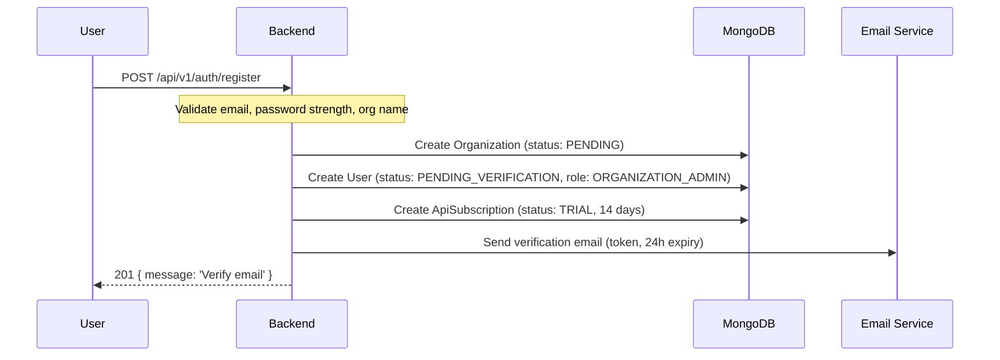
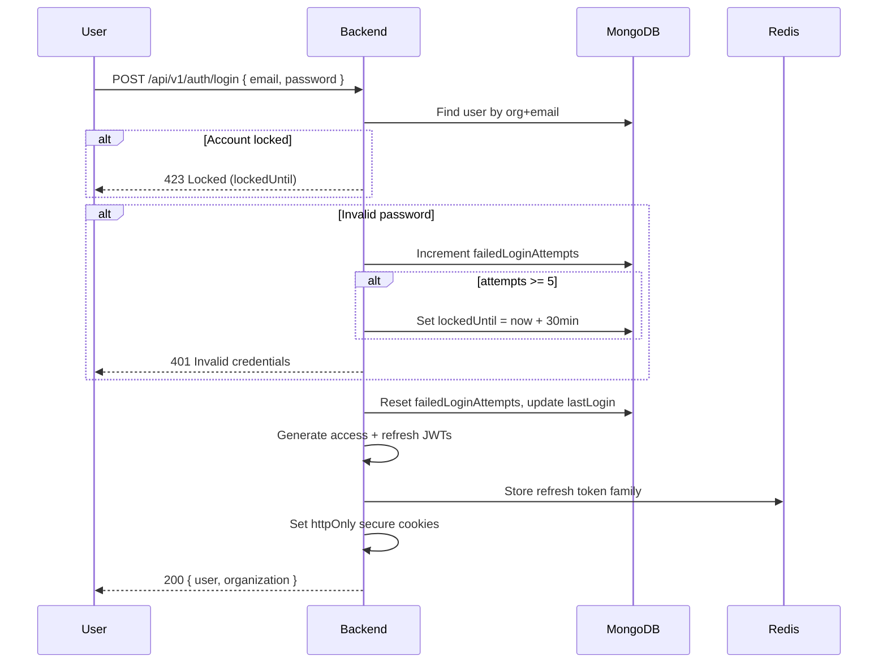

# Phase 4 — Authentication & Authorization

## Token Architecture

| Token | Storage | Lifetime | Rotation |
|-------|---------|----------|----------|
| Access Token (JWT) | httpOnly cookie `prx_access` + optional `Authorization: Bearer` | 15 minutes | Reissued on refresh |
| Refresh Token (JWT) | httpOnly cookie `prx_refresh` | 7 days | Rotated on every refresh |
| API Key | Client stores | Until revoked/expired | N/A |
| Internal Service Token | Backend env / Secrets Manager | 24 hours | Auto-rotated |

### JWT Payload (Access Token)

```typescript
interface AccessTokenPayload {
  sub: string;           // user publicId
  userId: string;          // MongoDB _id
  organizationId: string;
  role: UserRole;
  email: string;
  type: 'access';
  jti: string;             // unique token ID for revocation
  iat: number;
  exp: number;
}
```

### Refresh Token Storage (Redis)

```
Key: refresh:{jti}
Value: { userId, organizationId, familyId, createdAt }
TTL: 7 days

Key: refresh_family:{familyId}
Value: Set of active jti (for reuse detection)
```

**Refresh Rotation Flow:**
1. Client sends refresh cookie → Backend validates JWT + Redis entry.
2. Backend detects refresh token reuse (jti not in family set) → **Revoke entire family** → Force re-login.
3. On valid refresh: delete old jti, issue new access + refresh with same `familyId`.

---

## Auth Flows

### Registration



### Login



### Password Reset

```
POST /auth/forgot-password { email }
  → Generate crypto token (32 bytes, SHA-256 stored)
  → Set passwordResetExpires = now + 1 hour
  → Send email with link: /reset-password?token=xxx

POST /auth/reset-password { token, newPassword }
  → Validate token not expired
  → Hash new password (bcrypt 12)
  → Clear reset token
  → Revoke all refresh token families (force re-login)
  → Audit log: USER.PASSWORD_RESET
```

---

## Session Management

### Active Sessions (Redis)

```
Key: sessions:{userId}
Value: Sorted set of { jti, device, ip, lastActive, createdAt }
Max: 10 sessions per user
```

**Endpoints:**
- `GET /auth/sessions` — List active sessions
- `DELETE /auth/sessions/:jti` — Revoke single session
- `POST /auth/logout-all` — Revoke all refresh families + clear cookies

---

## RBAC Matrix

| Resource / Action | SUPER_ADMIN | ORGANIZATION_ADMIN | ANALYST |
|-------------------|:-----------:|:------------------:|:-------:|
| **Platform** |
| Manage all organizations | ✅ | ❌ | ❌ |
| View platform metrics | ✅ | ❌ | ❌ |
| Manage global API plans | ✅ | ❌ | ❌ |
| **Organization** |
| View org settings | ✅ | ✅ | ✅ (read) |
| Update org settings | ✅ | ✅ | ❌ |
| Manage team members | ✅ | ✅ | ❌ |
| Invite/remove users | ✅ | ✅ | ❌ |
| **API Keys** |
| Create/revoke API keys | ✅ | ✅ | ❌ |
| View API usage | ✅ | ✅ | ✅ |
| **Shipments** |
| Create/view shipments | ✅ | ✅ | ✅ |
| Delete shipments | ✅ | ✅ | ❌ |
| **Predictions** |
| Run predictions | ✅ | ✅ | ✅ |
| View SHAP explanations | ✅ | ✅ | ✅ |
| Batch evaluate | ✅ | ✅ | ✅ |
| **Datasets** |
| Upload datasets | ✅ | ✅ | ❌ |
| View datasets | ✅ | ✅ | ✅ |
| Delete datasets | ✅ | ✅ | ❌ |
| **Models** |
| Train models | ✅ | ✅ | ❌ |
| Activate/rollback models | ✅ | ✅ | ❌ |
| View model metrics | ✅ | ✅ | ✅ |
| **Reports** |
| Generate reports | ✅ | ✅ | ✅ |
| Schedule reports | ✅ | ✅ | ❌ |
| **Webhooks** |
| Configure webhooks | ✅ | ✅ | ❌ |
| View delivery logs | ✅ | ✅ | ✅ |
| **Billing** |
| View/change subscription | ✅ | ✅ | ❌ |
| **Audit Logs** |
| View audit logs | ✅ | ✅ | ❌ |

---

## Middleware Design

### Middleware Chain (Dashboard Routes)

```typescript
// Order matters
router.use(requestIdMiddleware);
router.use(helmet());
router.use(cors(corsOptions));
router.use(cookieParser());
router.use(express.json({ limit: '1mb' }));
router.use(rateLimiter({ windowMs: 60000, max: 100 }));

// Protected routes
router.use('/dashboard', authMiddleware, tenantContextMiddleware, auditLogMiddleware);
router.use('/dashboard/admin', rbacMiddleware(['ORGANIZATION_ADMIN', 'SUPER_ADMIN']));
```

### authMiddleware

```typescript
export async function authMiddleware(req: Request, res: Response, next: NextFunction) {
  const token = req.cookies.prx_access || extractBearerToken(req.headers.authorization);
  if (!token) throw new ApiError(401, 'AUTH_REQUIRED', 'Authentication required');

  try {
    const payload = jwt.verify(token, config.jwt.accessSecret) as AccessTokenPayload;
    if (payload.type !== 'access') throw new ApiError(401, 'INVALID_TOKEN', 'Invalid token type');

    // Check revocation
    const revoked = await redis.get(`revoked:${payload.jti}`);
    if (revoked) throw new ApiError(401, 'TOKEN_REVOKED', 'Token has been revoked');

    req.user = payload;
    next();
  } catch (err) {
    if (err instanceof jwt.TokenExpiredError) {
      throw new ApiError(401, 'TOKEN_EXPIRED', 'Access token expired');
    }
    throw new ApiError(401, 'INVALID_TOKEN', 'Invalid access token');
  }
}
```

### rbacMiddleware

```typescript
export function rbacMiddleware(...allowedRoles: UserRole[]) {
  return (req: Request, _res: Response, next: NextFunction) => {
    if (!req.user) throw new ApiError(401, 'AUTH_REQUIRED');
    if (!allowedRoles.includes(req.user.role)) {
      throw new ApiError(403, 'FORBIDDEN', `Role ${req.user.role} not authorized`);
    }
    next();
  };
}
```

### apiKeyAuthMiddleware (Public API)

```typescript
export async function apiKeyAuthMiddleware(req: Request, _res: Response, next: NextFunction) {
  const apiKey = req.headers['x-api-key'] as string;
  if (!apiKey) throw new ApiError(401, 'API_KEY_REQUIRED');

  const keyHash = sha256(apiKey);
  const keyDoc = await apiKeyRepository.findByHash(keyHash);
  if (!keyDoc || keyDoc.status !== 'ACTIVE') throw new ApiError(401, 'INVALID_API_KEY');
  if (keyDoc.expiresAt && keyDoc.expiresAt < new Date()) throw new ApiError(401, 'API_KEY_EXPIRED');

  // Rate limit check
  await apiUsageService.checkAndIncrementRateLimit(keyDoc);

  req.tenant = { organizationId: keyDoc.organizationId };
  req.apiKey = keyDoc;
  next();
}
```

---

## Rate Limiting

| Context | Window | Limit | Key |
|---------|--------|-------|-----|
| Login | 15 min | 10 attempts | `rl:login:{ip}` |
| Register | 1 hour | 5 attempts | `rl:register:{ip}` |
| Forgot password | 1 hour | 3 attempts | `rl:forgot:{email_hash}` |
| Dashboard API | 1 min | 100 req | `rl:dash:{userId}` |
| Public API | 1 min | Plan-based | `rl:api:{orgId}` |
| Public API daily | 24 hours | Plan-based | `rl:api:daily:{orgId}` |

---

## Password Policy

```typescript
const passwordSchema = z.string()
  .min(8, 'Minimum 8 characters')
  .max(128, 'Maximum 128 characters')
  .regex(/[A-Z]/, 'Must contain uppercase letter')
  .regex(/[a-z]/, 'Must contain lowercase letter')
  .regex(/[0-9]/, 'Must contain digit')
  .regex(/[^A-Za-z0-9]/, 'Must contain special character');
```

**Additional checks:**
- Not in common password list (10k entries)
- Not containing user's email local part
- bcrypt cost factor: 12

---

## Cookie Configuration

```typescript
const cookieOptions = {
  access: {
    httpOnly: true,
    secure: process.env.NODE_ENV === 'production',
    sameSite: 'strict' as const,
    maxAge: 15 * 60 * 1000,
    path: '/',
  },
  refresh: {
    httpOnly: true,
    secure: process.env.NODE_ENV === 'production',
    sameSite: 'strict' as const,
    maxAge: 7 * 24 * 60 * 60 * 1000,
    path: '/api/v1/auth',
  },
};
```

---

## Security Implications

| Threat | Mitigation |
|--------|-----------|
| Token theft (XSS) | httpOnly cookies; no localStorage for tokens |
| CSRF | SameSite=Strict + CSRF token on state-changing dashboard requests |
| Refresh token reuse | Family rotation + full family revocation on reuse |
| Brute force login | Account lockout after 5 failures (30 min) + IP rate limit |
| API key leak | Key shown once on creation; only hash stored; instant revoke |
| Privilege escalation | RBAC middleware on every protected route; role in JWT verified server-side |
