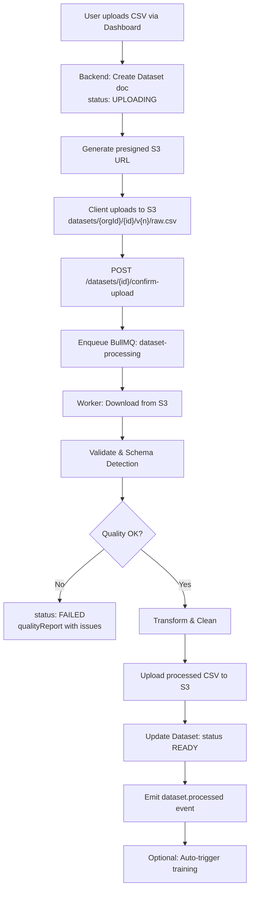

# Phase 7 — Dataset Management

## Processing Workflow



## CSV Upload

### Upload Initiation

```typescript
// POST /dashboard/datasets/upload/init
interface UploadInitRequest {
  fileName: string;
  fileSizeBytes: number;
  name: string;
  description?: string;
}

interface UploadInitResponse {
  datasetId: string;
  uploadUrl: string;          // S3 presigned PUT URL (15 min expiry)
  s3Key: string;
  expiresAt: string;
}
```

**Constraints:**
- Max file size: 100 MB (Starter), 500 MB (Growth), 2 GB (Enterprise)
- MIME: `text/csv` only
- File extension: `.csv`

## Validation Pipeline

### Stage 1: File Validation

```python
checks = [
    file_exists_and_readable,
    file_size_within_limit,
    encoding_is_utf8_or_latin1,
    has_header_row,
    min_rows(count >= 100),        # minimum for ML training
    max_rows(count <= 5_000_000),
    column_count(min=5, max=50),
]
```

### Stage 2: Schema Detection

```python
REQUIRED_MAPPINGS = {
    'destination_pincode': ['destination_pincode', 'pincode', 'to_pincode', 'delivery_pincode'],
    'weight_grams': ['weight_grams', 'weight', 'weight_g', 'package_weight'],
    'cod': ['cod', 'is_cod', 'cash_on_delivery'],
    'order_value': ['order_value', 'order_amount', 'invoice_value'],
    'courier': ['courier', 'courier_name', 'courier_code', 'carrier'],
    'status': ['status', 'delivery_status', 'shipment_status'],
}

OPTIONAL_MAPPINGS = {
    'origin_pincode': ['origin_pincode', 'from_pincode'],
    'cod_amount': ['cod_amount', 'cod_value'],
    'address_quality': ['address_quality', 'address_score'],
    'delivery_days': ['delivery_days', 'tat', 'turnaround_days'],
    'order_date': ['order_date', 'created_at', 'shipment_date'],
}
```

Auto-detection algorithm:
1. Normalize column headers (lowercase, strip, replace spaces with `_`).
2. Fuzzy match against mapping dictionary (Levenshtein distance ≤ 2).
3. Infer types from first 1000 rows (numeric, boolean, date, string).
4. Present mapping UI for user confirmation on ambiguous columns.

### Stage 3: Data Quality Checks

| Check | Severity | Rule |
|-------|----------|------|
| Missing pincode | ERROR | > 5% null in destination_pincode |
| Invalid pincode | ERROR | Not matching `/^\d{6}$/` |
| Missing weight | WARNING | > 10% null |
| Invalid weight | ERROR | ≤ 0 or > 50000 |
| Missing status | ERROR | > 1% null |
| Invalid status values | WARNING | Not in `[delivered, rto, cancelled, in_transit]` |
| Duplicate rows | WARNING | Exact duplicate count |
| Outlier weight | WARNING | > 3 std dev from mean |
| Future dates | ERROR | order_date > today |
| COD inconsistency | WARNING | cod=true but cod_amount=0 |

**Quality Score Formula:**
```
score = 100
  - (error_count × 10)
  - (warning_count × 2)
  - (missing_value_pct × 0.5)
  - (duplicate_pct × 3)
score = max(0, min(100, score))
```

Minimum score for training: **70**

## Dataset Versioning

```
Dataset "Q1 Shipments"
  ├── v1 (2026-01-15) — ARCHIVED
  ├── v2 (2026-03-20) — ARCHIVED
  └── v3 (2026-06-01) — READY (current)
```

- Same `name` + incrementing `version` number.
- Previous versions set to `ARCHIVED` (not deleted).
- Models reference specific `datasetId` + version.

## S3 Storage Structure

```
s3://predixroute-prod-assets/
  datasets/
    {organizationId}/
      {datasetId}/
        v1/
          raw.csv
          processed.csv
          schema.json
          quality_report.json
        v2/
          raw.csv
          processed.csv
```

**S3 Lifecycle:**
- Raw files: transition to Glacier after 90 days
- Processed files: retained while dataset status ≠ ARCHIVED
- Deleted datasets: S3 objects removed after 30-day soft delete

## Metadata Tracking

Each dataset stores:
- Upload user, timestamp
- Original filename, size
- Row/column counts post-processing
- Schema with detected types
- Column mapping (user-confirmed)
- Quality report with issue details
- Processing duration, job ID
- Lineage: which models trained on this dataset

## API Endpoints

| Method | Path | Description |
|--------|------|-------------|
| POST | `/dashboard/datasets/upload/init` | Get presigned URL |
| POST | `/dashboard/datasets/:id/confirm` | Confirm upload, start processing |
| GET | `/dashboard/datasets/:id/preview` | First 50 rows preview |
| GET | `/dashboard/datasets/:id/quality` | Quality report |
| PUT | `/dashboard/datasets/:id/mapping` | Confirm column mapping |
| GET | `/dashboard/datasets/:id/versions` | List versions |
| DELETE | `/dashboard/datasets/:id` | Soft delete |
