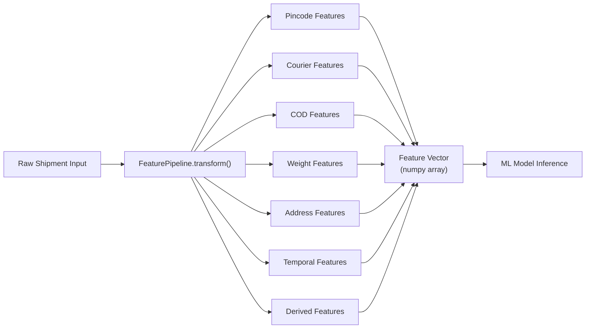

# Phase 8 — Feature Engineering

## Feature Pipeline Architecture



## Complete Feature List (28 features)

| # | Feature Name | Source | Type |
|---|-------------|--------|------|
| 1 | `pincode_risk_score` | PincodePerformance lookup | float 0–100 |
| 2 | `pincode_success_rate` | PincodePerformance | float 0–1 |
| 3 | `pincode_rto_rate` | PincodePerformance | float 0–1 |
| 4 | `pincode_avg_delivery_days` | PincodePerformance | float |
| 5 | `pincode_tier_encoded` | Pincode tier mapping | int 0–4 |
| 6 | `pincode_cod_risk_score` | PincodePerformance | float 0–100 |
| 7 | `pincode_shipment_volume_log` | log(totalShipments) | float |
| 8 | `best_courier_success_rate` | Best courier for pincode | float 0–1 |
| 9 | `courier_count_available` | len(availableCouriers) | int |
| 10 | `top_courier_success_rate` | Best available courier perf | float 0–1 |
| 11 | `avg_courier_success_rate` | Mean of available couriers | float 0–1 |
| 12 | `courier_success_rate_spread` | max - min success rates | float |
| 13 | `selected_courier_success_rate` | If pre-selected courier | float 0–1 |
| 14 | `cod_flag` | cod boolean | int 0/1 |
| 15 | `cod_amount_normalized` | codAmount / orderValue | float 0–1 |
| 16 | `cod_amount_log` | log1p(codAmount) | float |
| 17 | `cod_risk_bucket` | COD amount tier | int 0–4 |
| 18 | `order_value_log` | log1p(orderValue) | float |
| 19 | `weight_grams_normalized` | weight / 50000 | float 0–1 |
| 20 | `weight_bucket` | Weight category | int 0–5 |
| 21 | `weight_risk_score` | Heavier = higher risk | float 0–100 |
| 22 | `address_quality_score` | Direct input | float 0–1 |
| 23 | `address_quality_bucket` | Quality tier | int 0–3 |
| 24 | `address_risk_score` | 100 - (quality × 100) | float 0–100 |
| 25 | `day_of_week` | Order/eval day | int 0–6 |
| 26 | `is_weekend` | Saturday/Sunday | int 0/1 |
| 27 | `is_festival_season` | Indian festival calendar | int 0/1 |
| 28 | `value_to_weight_ratio` | orderValue / weightGrams | float |

---

## Feature Transformations

### 1. Pincode Risk

```python
def compute_pincode_features(pincode: str, org_id: str, perf_lookup) -> dict:
    perf = perf_lookup.get(pincode, org_id)
    if not perf:
        return {
            'pincode_risk_score': 50.0,       # default medium risk
            'pincode_success_rate': 0.85,
            'pincode_rto_rate': 0.15,
            'pincode_avg_delivery_days': 4.0,
            'pincode_tier_encoded': 2,
            'pincode_cod_risk_score': 50.0,
            'pincode_shipment_volume_log': 0.0,
            'best_courier_success_rate': 0.85,
        }
    return {
        'pincode_risk_score': perf.metrics.risk_score,
        'pincode_success_rate': perf.metrics.success_rate,
        'pincode_rto_rate': perf.metrics.rto_rate,
        'pincode_avg_delivery_days': perf.metrics.avg_delivery_days,
        'pincode_tier_encoded': TIER_MAP.get(perf.tier, 2),
        'pincode_cod_risk_score': perf.metrics.cod_risk_score,
        'pincode_shipment_volume_log': np.log1p(perf.metrics.total_shipments),
        'best_courier_success_rate': perf.courier_breakdown[0].success_rate if perf.courier_breakdown else 0.85,
    }

TIER_MAP = {'METRO': 0, 'TIER1': 1, 'TIER2': 2, 'TIER3': 3, 'RURAL': 4}
```

### 2. Courier Risk & Success Rate

```python
def compute_courier_features(available_couriers: list, pincode: str, org_id: str, lookup) -> dict:
    rates = []
    for courier in available_couriers:
        perf = lookup.get_courier_pincode(courier, pincode, org_id)
        rates.append(perf.success_rate if perf else 0.80)

    return {
        'courier_count_available': len(available_couriers),
        'top_courier_success_rate': max(rates) if rates else 0.80,
        'avg_courier_success_rate': np.mean(rates) if rates else 0.80,
        'courier_success_rate_spread': (max(rates) - min(rates)) if len(rates) > 1 else 0.0,
        'selected_courier_success_rate': rates[0] if rates else 0.80,
    }
```

### 3. COD Risk

```python
def compute_cod_features(cod: bool, cod_amount: float, order_value: float) -> dict:
    if not cod:
        return {'cod_flag': 0, 'cod_amount_normalized': 0.0, 'cod_amount_log': 0.0, 'cod_risk_bucket': 0}

    ratio = cod_amount / order_value if order_value > 0 else 1.0
    bucket = 0
    if cod_amount > 10000: bucket = 4
    elif cod_amount > 5000: bucket = 3
    elif cod_amount > 2000: bucket = 2
    elif cod_amount > 500: bucket = 1

    return {
        'cod_flag': 1,
        'cod_amount_normalized': min(ratio, 1.0),
        'cod_amount_log': np.log1p(cod_amount),
        'cod_risk_bucket': bucket,
    }
```

### 4. Weight Risk

```python
WEIGHT_BUCKETS = [(0, 500, 0), (500, 2000, 1), (2000, 5000, 2), (5000, 15000, 3), (15000, 30000, 4), (30000, 50000, 5)]

def compute_weight_features(weight_grams: int) -> dict:
    bucket = next(b for low, high, b in WEIGHT_BUCKETS if low < weight_grams <= high)
    risk = min(100, (weight_grams / 50000) * 60 + bucket * 8)
    return {
        'weight_grams_normalized': weight_grams / 50000,
        'weight_bucket': bucket,
        'weight_risk_score': risk,
    }
```

### 5. Address Quality

```python
def compute_address_features(score: float) -> dict:
    bucket = 0 if score >= 0.8 else 1 if score >= 0.6 else 2 if score >= 0.4 else 3
    return {
        'address_quality_score': score,
        'address_quality_bucket': bucket,
        'address_risk_score': (1 - score) * 100,
    }
```

### 6. Delivery Speed (Historical)

Derived from pincode + courier performance:
```python
'delivery_speed_score': 1 - min(avg_delivery_days / 10, 1.0)  # normalized 0-1
```

### 7. Temporal Features

```python
def compute_temporal_features(eval_date: datetime) -> dict:
    return {
        'day_of_week': eval_date.weekday(),
        'is_weekend': int(eval_date.weekday() >= 5),
        'is_festival_season': int(is_festival_period(eval_date)),  # Diwali, Holi windows
    }
```

---

## Training vs Inference Pipeline

| Stage | Training | Inference |
|-------|----------|-----------|
| Input | CSV batch (pandas DataFrame) | Single shipment JSON |
| Pincode lookup | Bulk preload into dict | Redis cache → MongoDB fallback |
| Output | X (features), y (delivered=1) | Feature vector → model.predict_proba |
| Scaling | StandardScaler fit on train | Load saved scaler from model artifact |
| Missing perf data | Exclude row or impute median | Default values (conservative) |

## Feature Store Caching (Redis)

```
Key: features:pincode:{orgId}:{pincode}
TTL: 300 seconds
Value: JSON of pincode feature dict

Key: features:courier:{orgId}:{courier}:{pincode}
TTL: 300 seconds
```

## Target Variable (Training)

```python
# Binary classification
y = (df['status'].str.lower() == 'delivered').astype(int)

# For multi-class (future):
# y = df['status'].map({'delivered': 0, 'rto': 1, 'cancelled': 2})
```
