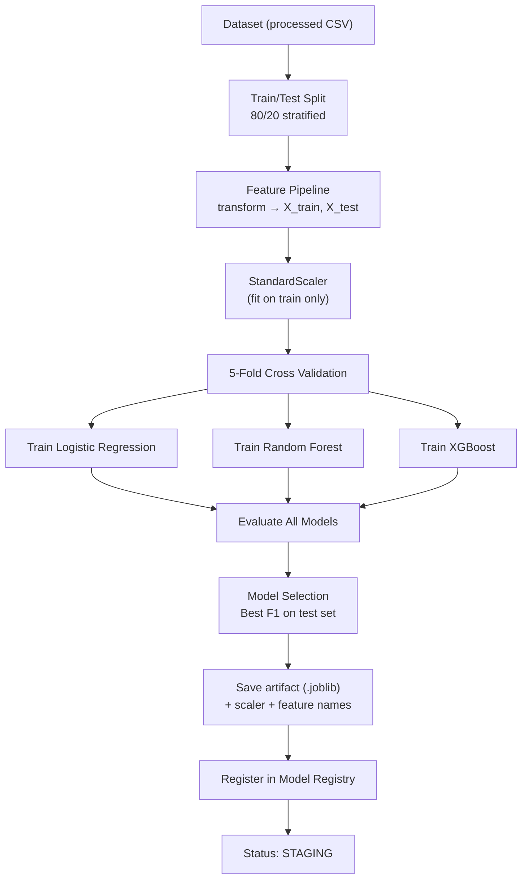

# Phase 9 — Machine Learning Architecture

## Model Portfolio

| Model | Library | Strengths | Use Case |
|-------|---------|-----------|----------|
| Logistic Regression | scikit-learn | Interpretable, fast baseline | Benchmark, fallback |
| Random Forest | scikit-learn | Non-linear interactions, robust | Secondary candidate |
| XGBoost | xgboost | Best performance, handles imbalance | Primary production model |

## Training Pipeline



## Training Pipeline Code Structure

```python
# ai-service/app/ml/pipelines/training_pipeline.py

class TrainingPipeline:
    def __init__(self, config: TrainingConfig):
        self.config = config
        self.feature_pipeline = FeaturePipeline()
        self.models = {
            'LOGISTIC_REGRESSION': LogisticRegressionModel(),
            'RANDOM_FOREST': RandomForestModel(),
            'XGBOOST': XGBoostModel(),
        }

    def run(self, dataset_path: str, organization_id: str) -> TrainingResult:
        # 1. Load data
        df = pd.read_csv(dataset_path)
        X, y = self.feature_pipeline.prepare_training_data(df, organization_id)

        # 2. Split
        X_train, X_test, y_train, y_test = train_test_split(
            X, y, test_size=0.2, stratify=y, random_state=42
        )

        # 3. Scale
        scaler = StandardScaler()
        X_train_scaled = scaler.fit_transform(X_train)
        X_test_scaled = scaler.transform(X_test)

        # 4. Train all models with cross-validation
        results = {}
        for name, model_wrapper in self.models.items():
            cv_scores = cross_val_score(
                model_wrapper.estimator, X_train_scaled, y_train,
                cv=5, scoring='f1', n_jobs=-1
            )
            model_wrapper.fit(X_train_scaled, y_train)
            y_pred = model_wrapper.predict(X_test_scaled)
            y_proba = model_wrapper.predict_proba(X_test_scaled)[:, 1]

            results[name] = ModelResult(
                algorithm=name,
                cv_scores=cv_scores.tolist(),
                cv_mean=cv_scores.mean(),
                cv_std=cv_scores.std(),
                test_metrics=self._compute_metrics(y_test, y_pred, y_proba),
                model=model_wrapper,
            )

        # 5. Select best model
        best = self._select_best_model(results)

        # 6. Save artifact
        artifact_path = self._save_artifact(best, scaler, X.columns.tolist(), organization_id)

        return TrainingResult(
            best_algorithm=best.algorithm,
            metrics=best.test_metrics,
            all_results={k: v.test_metrics for k, v in results.items()},
            artifact_path=artifact_path,
        )
```

## Hyperparameters

```python
HYPERPARAMETERS = {
    'LOGISTIC_REGRESSION': {
        'C': 1.0,
        'max_iter': 1000,
        'class_weight': 'balanced',
        'solver': 'lbfgs',
    },
    'RANDOM_FOREST': {
        'n_estimators': 200,
        'max_depth': 15,
        'min_samples_split': 10,
        'min_samples_leaf': 5,
        'class_weight': 'balanced',
        'n_jobs': -1,
        'random_state': 42,
    },
    'XGBOOST': {
        'n_estimators': 300,
        'max_depth': 8,
        'learning_rate': 0.05,
        'subsample': 0.8,
        'colsample_bytree': 0.8,
        'scale_pos_weight': 'auto',  # computed from class imbalance
        'eval_metric': 'logloss',
        'random_state': 42,
    },
}
```

## Validation Pipeline

```python
class ValidationPipeline:
    METRICS = ['accuracy', 'precision', 'recall', 'f1', 'roc_auc']

    def compute_metrics(self, y_true, y_pred, y_proba) -> dict:
        return {
            'accuracy': accuracy_score(y_true, y_pred),
            'precision': precision_score(y_true, y_pred, zero_division=0),
            'recall': recall_score(y_true, y_pred, zero_division=0),
            'f1Score': f1_score(y_true, y_pred, zero_division=0),
            'aucRoc': roc_auc_score(y_true, y_proba),
            'confusionMatrix': confusion_matrix(y_true, y_pred).tolist(),
        }
```

## Model Selection Logic

```python
def select_best_model(results: dict[str, ModelResult]) -> ModelResult:
    """
    Selection criteria (in priority order):
    1. Highest F1 score on test set
    2. If F1 within 0.01 → prefer higher AUC-ROC
    3. If still tied → prefer simpler model (LR > RF > XGB)
    4. Minimum thresholds: F1 >= 0.65, AUC >= 0.70
    """
    MIN_F1 = 0.65
    MIN_AUC = 0.70
    COMPLEXITY = {'LOGISTIC_REGRESSION': 0, 'RANDOM_FOREST': 1, 'XGBOOST': 2}

    eligible = [
        r for r in results.values()
        if r.test_metrics['f1Score'] >= MIN_F1 and r.test_metrics['aucRoc'] >= MIN_AUC
    ]

    if not eligible:
        raise TrainingError(
            f"No model met minimum thresholds (F1>={MIN_F1}, AUC>={MIN_AUC}). "
            f"Best F1: {max(r.test_metrics['f1Score'] for r in results.values()):.3f}"
        )

    eligible.sort(
        key=lambda r: (
            -r.test_metrics['f1Score'],
            -r.test_metrics['aucRoc'],
            COMPLEXITY[r.algorithm],
        )
    )
    return eligible[0]
```

## Inference Pipeline

```python
class InferencePipeline:
    def __init__(self, model_registry: ModelRegistryService):
        self.registry = model_registry
        self.feature_pipeline = FeaturePipeline()

    def predict(self, organization_id: str, input_data: dict) -> PredictionOutput:
        # Load active model
        model_entry = self.registry.get_active_model(organization_id, 'RISK_PREDICTION')
        artifact = joblib.load(model_entry.artifact_path)

        model = artifact['model']
        scaler = artifact['scaler']
        feature_names = artifact['feature_names']

        # Transform features
        features = self.feature_pipeline.transform(input_data, organization_id)
        X = pd.DataFrame([features])[feature_names]
        X_scaled = scaler.transform(X)

        # Predict
        proba = model.predict_proba(X_scaled)[0]
        delivery_probability = proba[1]  # P(delivered)
        risk_score = round((1 - delivery_probability) * 100, 1)
        risk_level = self._classify_risk(risk_score)

        return PredictionOutput(
            delivery_probability=round(delivery_probability, 4),
            risk_score=risk_score,
            risk_level=risk_level,
            model_id=model_entry.id,
            model_version=model_entry.version,
        )

    def _classify_risk(self, score: float) -> str:
        if score < 25: return 'LOW'
        if score < 50: return 'MEDIUM'
        if score < 75: return 'HIGH'
        return 'CRITICAL'
```

## Metrics Tracking

Stored in MongoDB `Models` collection after training:

```json
{
  "metrics": {
    "accuracy": 0.912,
    "precision": 0.895,
    "recall": 0.934,
    "f1Score": 0.914,
    "aucRoc": 0.956,
    "confusionMatrix": [[850, 42], [38, 1070]],
    "crossValidationScores": [0.908, 0.915, 0.911, 0.918, 0.910]
  },
  "comparison": {
    "previousVersion": "1.1.0",
    "improvementPercent": 2.3
  }
}
```

## Class Imbalance Handling

Typical logistics data: ~85% delivered, ~15% RTO/failed.

- `class_weight='balanced'` for LR and RF
- `scale_pos_weight = count(negative) / count(positive)` for XGBoost
- Stratified splits and cross-validation
- Evaluation prioritizes F1 and AUC over accuracy

## Artifact Structure (.joblib)

```python
artifact = {
    'model': trained_model,           # sklearn/xgb estimator
    'scaler': standard_scaler,        # fitted StandardScaler
    'feature_names': list[str],       # ordered feature names
    'algorithm': 'XGBOOST',
    'version': '1.2.0',
    'trained_at': '2026-06-10T12:00:00Z',
    'metrics': {...},
    'hyperparameters': {...},
}
joblib.dump(artifact, f'models/registry/versions/{org_id}_v1.2.0.joblib')
```
