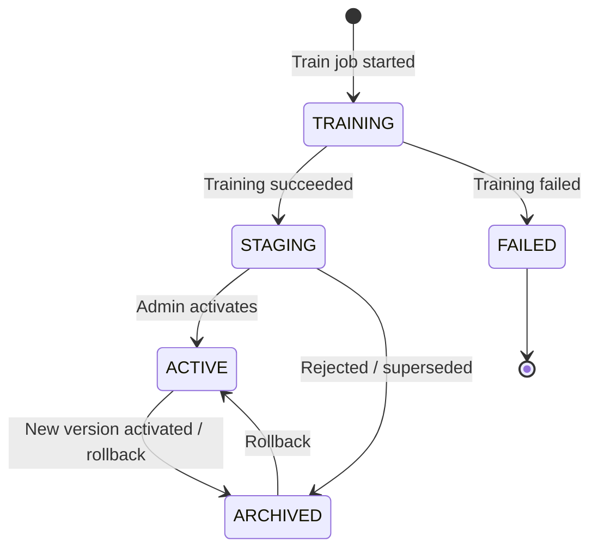

# Phase 10 — Model Registry

## Registry Schema

```typescript
interface ModelRegistryEntry {
  id: string;                          // MongoDB _id
  publicId: string;
  organizationId: string;
  name: string;                        // 'risk-predictor'
  type: 'RISK_PREDICTION' | 'COURIER_RANKING';
  algorithm: 'LOGISTIC_REGRESSION' | 'RANDOM_FOREST' | 'XGBOOST';
  version: string;                     // semver
  status: 'TRAINING' | 'STAGING' | 'ACTIVE' | 'ARCHIVED' | 'FAILED';
  artifact: {
    s3Key: string;
    localPath: string | null;
    sizeBytes: number;
    checksum: string;                  // SHA-256
  };
  featureNames: string[];
  hyperparameters: Record<string, unknown>;
  metrics: ModelMetrics;
  lineage: {
    datasetId: string;
    datasetVersion: number;
    trainingJobId: string;
    trainedAt: string;
    trainedBy: string;
  };
  lifecycle: {
    createdAt: string;
    stagingAt: string | null;
    activatedAt: string | null;
    activatedBy: string | null;
    archivedAt: string | null;
    previousActiveVersion: string | null;
  };
}
```

## Versioning Strategy

- **Semantic Versioning:** `MAJOR.MINOR.PATCH`
  - MAJOR: Feature set change (new features added/removed)
  - MINOR: Retrained on new data, same features
  - PATCH: Hyperparameter tuning only
- Auto-increment: Backend reads latest version for `{orgId, name}` and bumps MINOR on retrain.

## Model Lifecycle



## Activation Flow

```
POST /dashboard/models/{publicId}/activate
  1. Verify model status === STAGING
  2. Begin MongoDB transaction:
     a. Set current ACTIVE model (same orgId + type) → ARCHIVED
     b. Set target model → ACTIVE, activatedAt = now
  3. Call AI service: POST /internal/v1/models/activate
     → AI service loads new artifact into memory cache
  4. Invalidate Redis cache: model:active:{orgId}:{type}
  5. Audit log: MODEL.ACTIVATED
  6. Emit webhook: model.trained (with activation metadata)
```

## Rollback Flow

```
POST /dashboard/models/{publicId}/rollback
  1. Verify target model status === ARCHIVED (was previously ACTIVE)
  2. Same transaction as activation but in reverse
  3. Reload previous artifact in AI service
  4. Audit log: MODEL.ROLLED_BACK
```

## Metrics Tracking & Comparison

```typescript
interface ModelComparison {
  currentVersion: string;
  previousVersion: string;
  metrics: {
    current: ModelMetrics;
    previous: ModelMetrics;
    delta: {
      f1Score: number;       // current - previous
      aucRoc: number;
      accuracy: number;
    };
  };
  recommendation: 'ACTIVATE' | 'KEEP_CURRENT' | 'INVESTIGATE';
}
```

**Auto-recommendation logic:**
- If new F1 > current F1 + 0.01 → `ACTIVATE`
- If new F1 < current F1 - 0.02 → `KEEP_CURRENT`
- Otherwise → `INVESTIGATE`

## AI Service In-Memory Cache

```python
class ModelRegistryService:
    _cache: dict[str, LoadedModel] = {}  # key: f"{org_id}:{model_type}"

    def get_active_model(self, org_id: str, model_type: str) -> LoadedModel:
        cache_key = f"{org_id}:{model_type}"
        if cache_key not in self._cache:
            metadata = self._fetch_from_backend(org_id, model_type)
            artifact = self._download_artifact(metadata.s3_key)
            self._cache[cache_key] = LoadedModel(artifact)
        return self._cache[cache_key]

    def activate(self, org_id: str, model_type: str, artifact_path: str):
        cache_key = f"{org_id}:{model_type}"
        artifact = joblib.load(artifact_path)
        self._cache[cache_key] = LoadedModel(artifact)
```

## Registry API Endpoints

| Method | Path | Description |
|--------|------|-------------|
| GET | `/dashboard/models` | List all models |
| GET | `/dashboard/models/:id` | Model details + metrics |
| POST | `/dashboard/models/train` | Start training job |
| POST | `/dashboard/models/:id/activate` | Activate staging model |
| POST | `/dashboard/models/:id/rollback` | Rollback to archived |
| GET | `/dashboard/models/compare?v1=x&v2=y` | Side-by-side comparison |
| GET | `/dashboard/models/active` | Current active model info |
