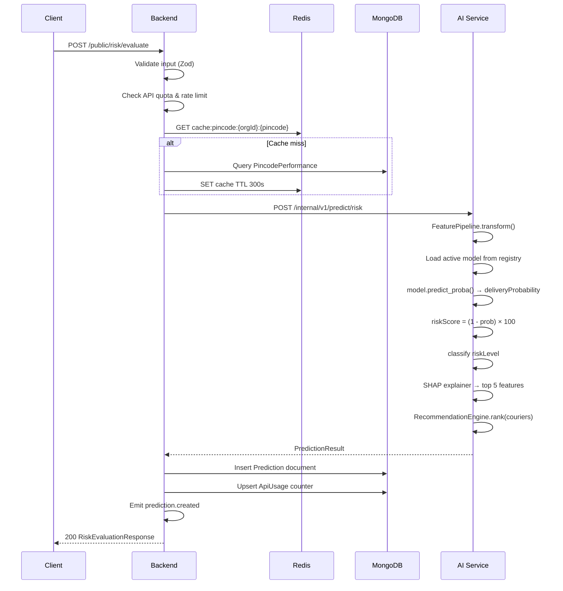

# Phase 11 — Shipment Risk Engine

## Complete Prediction Workflow



## Input Schema

```typescript
interface RiskEvaluateInput {
  destinationPincode: string;     // 6-digit Indian pincode
  weightGrams: number;            // 1–50000
  cod: boolean;
  codAmount: number | null;
  orderValue: number;             // INR
  addressQualityScore: number;    // 0.0–1.0
  availableCouriers: string[];    // 1–20 courier codes
  externalRef?: string;
}
```

## Output Schema

```typescript
interface RiskEvaluateOutput {
  predictionId: string;
  deliveryProbability: number;    // 0.0–1.0
  riskScore: number;              // 0–100
  riskLevel: 'LOW' | 'MEDIUM' | 'HIGH' | 'CRITICAL';
  recommendedCourier: string;
  courierRankings: CourierRanking[];
  explanations: ShapExplanation[];
  modelVersion: string;
  evaluatedAt: string;
}

interface ShapExplanation {
  feature: string;
  value: number | string;
  impact: number;
  direction: 'INCREASES_RISK' | 'DECREASES_RISK';
  description: string;
}
```

## Risk Classification

| Risk Level | Score Range | Business Meaning |
|------------|-------------|------------------|
| LOW | 0–24 | High delivery confidence |
| MEDIUM | 25–49 | Monitor; consider premium courier |
| HIGH | 50–74 | Significant RTO risk; manual review recommended |
| CRITICAL | 75–100 | Very likely to fail; block or require prepayment |

## Risk Score Computation

```python
delivery_probability = model.predict_proba(features)[0][1]
risk_score = round((1 - delivery_probability) * 100, 1)
risk_level = classify(risk_score)
```

## Decision Logic (Business Rules Layer)

Applied AFTER ML prediction in backend service:

```typescript
function applyBusinessRules(output: AiPredictionOutput, input: RiskEvaluateInput): RiskEvaluateOutput {
  let { riskScore, riskLevel } = output;

  // Rule 1: Critical pincode override
  if (input.pincodeRiskScore > 80) {
    riskScore = Math.max(riskScore, 60);
    riskLevel = classify(riskScore);
  }

  // Rule 2: Very low address quality boost
  if (input.addressQualityScore < 0.3) {
    riskScore = Math.min(100, riskScore + 15);
    riskLevel = classify(riskScore);
  }

  // Rule 3: High COD on rural pincode
  if (input.cod && input.codAmount > 5000 && input.pincodeTier === 'RURAL') {
    riskScore = Math.min(100, riskScore + 10);
    riskLevel = classify(riskScore);
  }

  return { ...output, riskScore, riskLevel };
}
```

## Performance Targets

| Metric | Target |
|--------|--------|
| End-to-end latency (p95) | < 200ms |
| AI inference only (p95) | < 50ms |
| Throughput per AI instance | 500 req/sec |
| Cache hit rate (pincode) | > 80% |

## Batch Risk Evaluation

Same pipeline per item; parallelized in AI service with `asyncio.gather` (max concurrency: 10).

Failed items return individual errors without failing entire batch.
