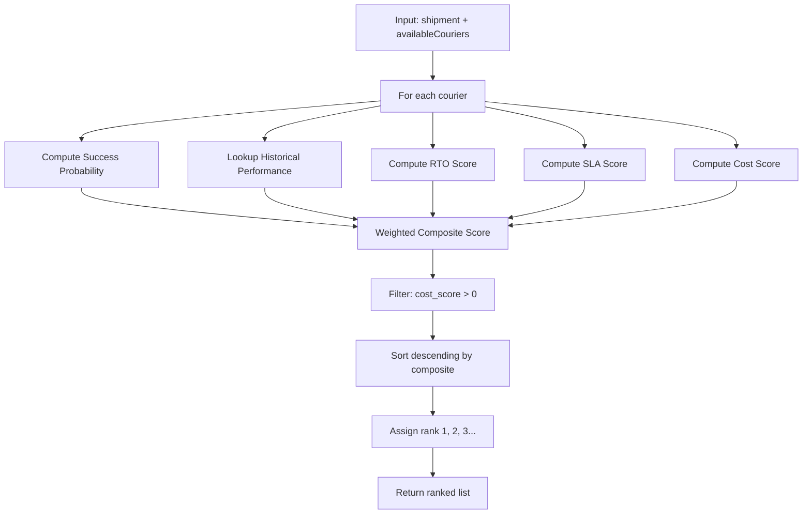

# Phase 12 — Courier Recommendation Engine

## Ranking Formula

```
CompositeScore = (0.40 × SuccessProbability)
               + (0.25 × HistoricalPerformance)
               + (0.15 × RTOScore)
               + (0.10 × SLAScore)
               + (0.10 × CostScore)
```

All component scores normalized to 0–100 before weighting.

## Component Calculations

### 1. Success Probability (40%)

```python
# ML model prediction for each courier (courier-specific feature)
success_prob = model.predict_proba(features_with_courier=courier)[0][1]
success_score = success_prob * 100
weighted = success_score * 0.40
```

### 2. Historical Courier Performance (25%)

```python
perf = courier_performance_lookup(courier, pincode, org_id)
historical_score = perf.success_rate * 100 if perf else 50.0  # default neutral
weighted = historical_score * 0.25
```

### 3. RTO Performance (15%)

```python
# Lower RTO = higher score
rto_rate = perf.rto_rate if perf else 0.15
rto_score = (1 - rto_rate) * 100
weighted = rto_score * 0.15
```

### 4. Delivery SLA (10%)

```python
avg_days = perf.avg_delivery_days if perf else 5.0
# Score: 1 day = 100, 10 days = 0
sla_score = max(0, min(100, (1 - avg_days / 10) * 100))
weighted = sla_score * 0.10
```

### 5. Cost Efficiency (10%)

```python
cost_per_kg = perf.avg_cost_per_kg if perf else 50.0
max_acceptable = cost_constraints.max_cost_per_kg if cost_constraints else 60.0
if cost_per_kg > max_acceptable:
    cost_score = 0  # disqualified on cost
else:
    cost_score = (1 - cost_per_kg / max_acceptable) * 100
weighted = cost_score * 0.10
```

## Ranking Pipeline



## Implementation

```python
class RecommendationService:
    WEIGHTS = {
        'success': 0.40,
        'performance': 0.25,
        'rto': 0.15,
        'sla': 0.10,
        'cost': 0.10,
    }

    def rank_couriers(
        self,
        input_data: RecommendationInput,
        organization_id: str,
    ) -> list[CourierRanking]:
        rankings = []

        for courier in input_data.available_couriers:
            breakdown = self._score_courier(courier, input_data, organization_id)
            if breakdown['cost_score'] <= 0 and input_data.cost_constraints:
                continue  # skip couriers exceeding cost limit

            composite = sum(breakdown[f'{k}_weighted'] for k in self.WEIGHTS)

            rankings.append(CourierRanking(
                courier=courier,
                score=round(composite, 1),
                success_probability=breakdown['success_prob'],
                breakdown=breakdown,
            ))

        rankings.sort(key=lambda r: r.score, reverse=True)
        for i, r in enumerate(rankings):
            r.rank = i + 1

        return rankings
```

## API Response Structure

```json
{
  "success": true,
  "data": {
    "recommendationId": "rec_m3n8k2j9",
    "recommendedCourier": "delhivery",
    "rankings": [
      {
        "rank": 1,
        "courier": "delhivery",
        "compositeScore": 87.3,
        "successProbability": 0.91,
        "estimatedDeliveryDays": 2.3,
        "estimatedCost": 42.0,
        "rtoRate": 0.06,
        "breakdown": {
          "successWeight": 36.4,
          "performanceWeight": 22.5,
          "rtoWeight": 14.1,
          "slaWeight": 7.7,
          "costWeight": 6.6
        }
      },
      {
        "rank": 2,
        "courier": "bluedart",
        "compositeScore": 82.1,
        "successProbability": 0.88,
        "estimatedDeliveryDays": 2.8,
        "estimatedCost": 48.5,
        "rtoRate": 0.08,
        "breakdown": { "...": "..." }
      }
    ],
    "evaluatedAt": "2026-06-10T14:30:00.000Z"
  }
}
```

## Tie-Breaking

When composite scores differ by < 0.5:
1. Higher success probability wins
2. Lower RTO rate wins
3. Lower estimated delivery days wins
4. Alphabetical courier code (deterministic)
