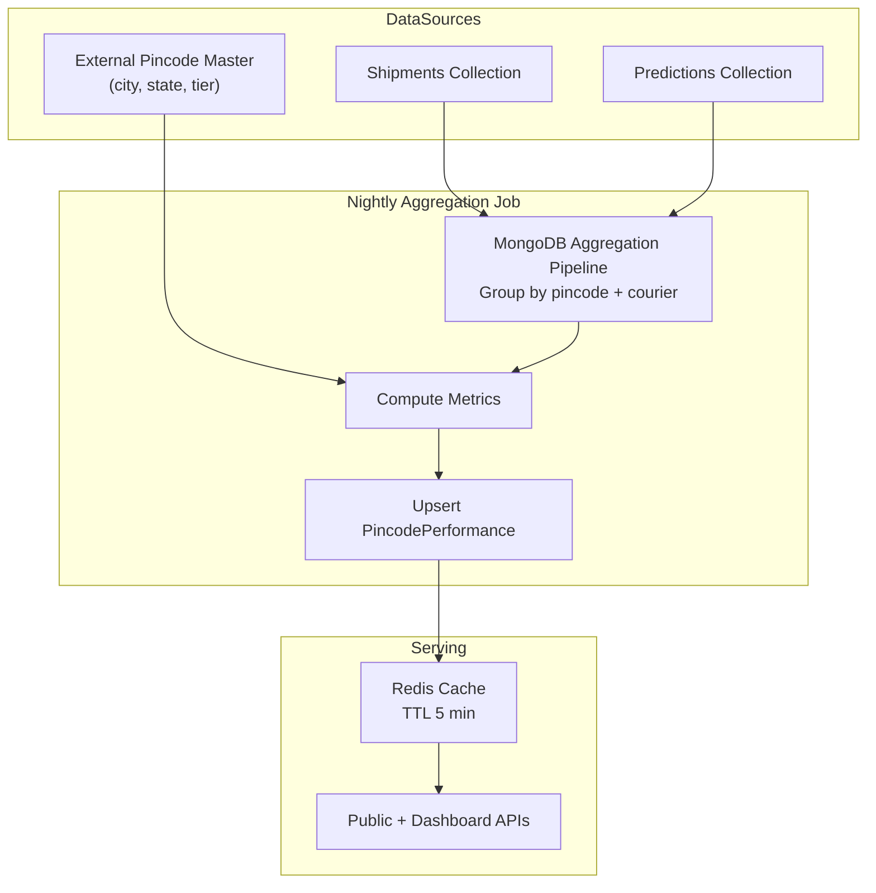

# Phase 13 — Pincode Intelligence

## Architecture



## Aggregation Pipeline

```javascript
db.shipments.aggregate([
  { $match: { organizationId: ObjectId(orgId), status: { $in: ['DELIVERED', 'RTO'] } } },
  { $group: {
      _id: { pincode: '$destinationPincode', courier: '$selectedCourier' },
      total: { $sum: 1 },
      delivered: { $sum: { $cond: [{ $eq: ['$status', 'DELIVERED'] }, 1, 0] } },
      rto: { $sum: { $cond: [{ $eq: ['$status', 'RTO'] }, 1, 0] } },
      avgDeliveryDays: { $avg: '$deliveryDays' },
  }},
  { $group: {
      _id: '$_id.pincode',
      courierBreakdown: { $push: {
          courierCode: '$_id.courier',
          successRate: { $divide: ['$delivered', '$total'] },
          rtoRate: { $divide: ['$rto', '$total'] },
          avgDeliveryDays: '$avgDeliveryDays',
          shipmentCount: '$total',
      }},
      totalShipments: { $sum: '$total' },
      totalDelivered: { $sum: '$delivered' },
      totalRto: { $sum: '$rto' },
  }},
])
```

## Metrics Provided

| Metric | Calculation |
|--------|-------------|
| Risk Score | `(rtoRate × 60) + ((1 - successRate) × 40)` scaled 0–100 |
| Success Rate | delivered / total |
| RTO Rate | rto / total |
| Best Courier | Highest successRate in courierBreakdown (min 10 shipments) |
| Worst Courier | Lowest successRate in courierBreakdown (min 10 shipments) |
| Historical Trends | Monthly aggregation stored in `trend[]` array |

## APIs

### Public: GET /api/v1/public/pincode/:pincode

See Phase 6 for response schema.

### Dashboard: GET /api/v1/dashboard/pincodes

Query params: `?page=1&limit=20&sort=riskScore&order=desc&tier=RURAL&minRisk=50`

### Dashboard: GET /api/v1/dashboard/pincodes/:pincode

Extended response includes:
- Full courier breakdown with shipment counts
- 12-month trend data
- Recent predictions for this pincode
- Comparison vs organization average

### Dashboard: GET /api/v1/dashboard/pincodes/heatmap

Returns pincode risk data for map visualization:
```json
{
  "data": [
    { "pincode": "110001", "riskScore": 15.2, "lat": 28.6139, "lng": 77.2090 },
    { "pincode": "845401", "riskScore": 72.8, "lat": 26.8467, "lng": 84.3563 }
  ]
}
```

## Pincode Master Data

Seeded from India Post pincode database:
- 6-digit pincode → city, state, district, tier classification
- Tier rules: Metro (top 8 cities), Tier1 (state capitals), Tier2 (>1M pop), Tier3 (>100K), Rural

## Refresh Schedule

- **Real-time:** Updated on each delivered/RTO shipment status change (debounced, 5 min)
- **Nightly batch:** Full recomputation at 02:00 IST via BullMQ cron job
- **Cache invalidation:** On aggregation update, purge `cache:pincode:{orgId}:{pincode}`
