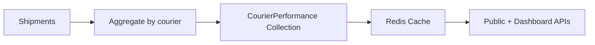

# Phase 14 — Courier Intelligence

## Architecture

Same aggregation pattern as Pincode Intelligence, grouped by `courierCode` instead of pincode.



## Metrics Provided

| Metric | Description |
|--------|-------------|
| Success Rate | Overall delivery success |
| RTO Rate | Return-to-origin rate |
| Avg Delivery Days | Mean delivery time |
| P90 Delivery Days | 90th percentile delivery time |
| COD Success Rate | Success rate for COD shipments only |
| Avg Cost Per Kg | Mean shipping cost per kg |
| Trend Analysis | Monthly success/RTO/delivery trends |
| Pincode Performance | Top 10 best / worst pincodes for this courier |

## Aggregation

```javascript
db.shipments.aggregate([
  { $match: { organizationId: ObjectId(orgId), selectedCourier: { $ne: null } } },
  { $group: {
      _id: { courier: '$selectedCourier', pincode: '$destinationPincode' },
      total: { $sum: 1 },
      delivered: { $sum: { $cond: [{ $eq: ['$status', 'DELIVERED'] }, 1, 0] } },
      rto: { $sum: { $cond: [{ $eq: ['$status', 'RTO'] }, 1, 0] } },
      avgDays: { $avg: '$deliveryDays' },
      codTotal: { $sum: { $cond: ['$cod', 1, 0] } },
      codDelivered: { $sum: { $cond: [{ $and: ['$cod', { $eq: ['$status', 'DELIVERED'] }] }, 1, 0] } },
  }},
  // ... further grouping by courier
])
```

## APIs

### Public: GET /api/v1/public/courier/:courier

See Phase 6.

### Dashboard: GET /api/v1/dashboard/couriers

List all couriers with summary metrics. Supports sorting by successRate, rtoRate, avgDeliveryDays.

### Dashboard: GET /api/v1/dashboard/couriers/:courier

Detailed view:
- Performance metrics (overall + COD-specific)
- 12-month trend chart data
- Pincode heatmap (best/worst performing pincodes)
- Comparison vs other couriers in organization
- Recent shipments using this courier

### Dashboard: GET /api/v1/dashboard/couriers/compare

Query: `?couriers=delhivery,bluedart,dtdc&pincode=110001`

Side-by-side comparison for specific pincode or overall.

## Courier Master Registry

```typescript
const COURIER_REGISTRY = {
  delhivery: { name: 'Delhivery', code: 'delhivery', type: 'EXPRESS' },
  bluedart: { name: 'Blue Dart', code: 'bluedart', type: 'PREMIUM' },
  dtdc: { name: 'DTDC', code: 'dtdc', type: 'STANDARD' },
  ecom_express: { name: 'Ecom Express', code: 'ecom_express', type: 'ECOMMERCE' },
  // ... extensible via admin config
};
```

Organizations can enable/disable couriers in their settings; disabled couriers excluded from recommendations.

## Trend Analysis

Monthly snapshots stored in `CourierPerformance.trend[]`:

```json
{
  "period": "2026-05",
  "successRate": 0.91,
  "rtoRate": 0.09,
  "avgDeliveryDays": 2.8,
  "totalShipments": 15420
}
```

Dashboard renders as multi-line chart (Recharts) with toggles for each metric.
