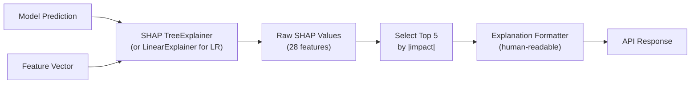

# Phase 15 — Explainable AI (SHAP)

## Architecture



## SHAP Workflow

```python
# ai-service/app/ml/explainability/shap_explainer.py

class ShapExplainer:
    def __init__(self):
        self._explainers: dict[str, shap.Explainer] = {}

    def get_explainer(self, model, algorithm: str):
        if algorithm == 'LOGISTIC_REGRESSION':
            return shap.LinearExplainer(model, self.background_data)
        elif algorithm in ('RANDOM_FOREST', 'XGBOOST'):
            return shap.TreeExplainer(model)
        raise ValueError(f'Unsupported algorithm: {algorithm}')

    def explain(
        self,
        model_artifact: LoadedModel,
        features: np.ndarray,
        feature_names: list[str],
        top_k: int = 5,
    ) -> list[Explanation]:
        explainer = self.get_explainer(model_artifact.model, model_artifact.algorithm)
        shap_values = explainer.shap_values(features)

        if isinstance(shap_values, list):
            shap_values = shap_values[1]  # positive class

        values = shap_values[0] if shap_values.ndim > 1 else shap_values

        # Pair features with SHAP values, sort by absolute impact
        pairs = sorted(
            zip(feature_names, features[0], values),
            key=lambda x: abs(x[2]),
            reverse=True,
        )[:top_k]

        return [self._format_explanation(name, val, impact) for name, val, impact in pairs]
```

## Explanation Formatter

```python
EXPLANATION_TEMPLATES = {
    'cod_amount_log': {
        'INCREASES_RISK': 'High COD amount ({value:.0f}) increases delivery risk',
        'DECREASES_RISK': 'Low COD amount reduces delivery risk',
    },
    'pincode_risk_score': {
        'INCREASES_RISK': 'Destination pincode has high historical RTO rate (risk score: {value:.0f})',
        'DECREASES_RISK': 'Destination pincode has strong delivery track record',
    },
    'address_quality_score': {
        'INCREASES_RISK': 'Poor address quality (score: {value:.2f}) increases failed delivery risk',
        'DECREASES_RISK': 'Good address quality supports successful delivery',
    },
    'top_courier_success_rate': {
        'INCREASES_RISK': 'Best available courier has low success rate for this lane ({value:.0%})',
        'DECREASES_RISK': 'Strong courier performance available for this destination',
    },
    'weight_risk_score': {
        'INCREASES_RISK': 'Package weight ({value:.0f}g bucket) increases handling risk',
        'DECREASES_RISK': 'Lightweight package reduces delivery complexity',
    },
}

def _format_explanation(self, feature: str, value, impact: float) -> Explanation:
    direction = 'INCREASES_RISK' if impact > 0 else 'DECREASES_RISK'
    template = EXPLANATION_TEMPLATES.get(feature, {}).get(direction, f'{feature} impact: {impact:.3f}')
    description = template.format(value=value) if '{' in template else template
    return Explanation(
        feature=feature,
        value=round(value, 4) if isinstance(value, float) else value,
        impact=round(float(impact), 4),
        direction=direction,
        description=description,
    )
```

## Example Explanations

### High COD Risk
```json
{
  "feature": "cod_amount_log",
  "value": 7.313,
  "impact": 0.182,
  "direction": "INCREASES_RISK",
  "description": "High COD amount (₹15,000) increases delivery risk"
}
```

### Poor Courier History
```json
{
  "feature": "top_courier_success_rate",
  "value": 0.62,
  "impact": 0.145,
  "direction": "INCREASES_RISK",
  "description": "Best available courier has low success rate for this lane (62%)"
}
```

### High Pincode Risk
```json
{
  "feature": "pincode_risk_score",
  "value": 78.5,
  "impact": 0.210,
  "direction": "INCREASES_RISK",
  "description": "Destination pincode has high historical RTO rate (risk score: 79)"
}
```

### Poor Address Quality
```json
{
  "feature": "address_quality_score",
  "value": 0.35,
  "impact": 0.128,
  "direction": "INCREASES_RISK",
  "description": "Poor address quality (score: 0.35) increases failed delivery risk"
}
```

### Low Success Probability
```json
{
  "feature": "avg_courier_success_rate",
  "value": 0.71,
  "impact": 0.095,
  "direction": "INCREASES_RISK",
  "description": "Available couriers have below-average success rates for this shipment profile"
}
```

## API Contracts

SHAP explanations included inline in risk evaluation response (top 5).

Dedicated endpoint for detailed explanation:

### POST /internal/v1/explain/shap (AI Service — Internal)

```json
// Request
{
  "organization_id": "org_xxx",
  "prediction_input": { "...": "same as risk evaluate" },
  "top_k": 10
}

// Response
{
  "explanations": [ "...array of Explanation objects..." ],
  "baseValue": 0.85,
  "modelVersion": "1.2.0"
}
```

### GET /api/v1/dashboard/predictions/:id/explanations

Returns full SHAP breakdown for dashboard detail view (all 28 features with impact bars).

## Performance

- SHAP computation adds ~10–20ms for TreeExplainer (XGBoost/RF)
- LinearExplainer (LR): ~2ms
- Background data: 100-sample subset from training data, cached per model version
- SHAP results NOT cached (each prediction is unique)

## Plan Gating

| Plan | SHAP Explanations |
|------|-------------------|
| Starter | Top 3 features |
| Growth | Top 5 features |
| Enterprise | All features + base value |
