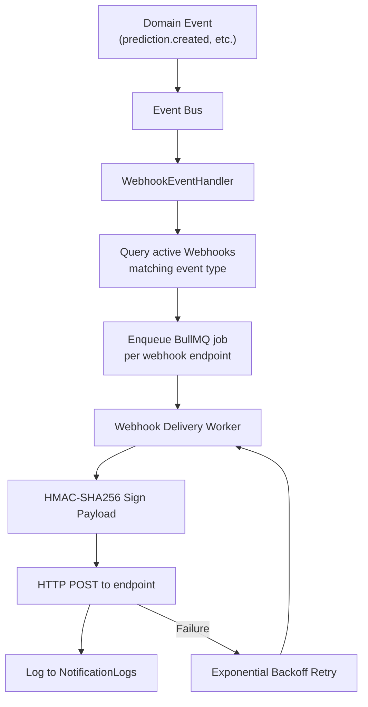

# Phase 16 — Webhook Infrastructure

## Architecture



## Supported Events

| Event | Trigger | Payload Summary |
|-------|---------|-----------------|
| `prediction.created` | After risk evaluation | predictionId, riskLevel, riskScore, externalRef |
| `model.trained` | Training job completes | modelId, version, algorithm, metrics |
| `dataset.processed` | Dataset processing completes | datasetId, rowCount, qualityScore, status |
| `report.generated` | Report generation completes | reportId, format, downloadUrl (presigned) |
| `api.limit.reached` | Quota threshold hit (90%, 100%) | limitType, currentUsage, planLimit |

## Webhook Payload Format

```json
{
  "id": "evt_k7x9m2n4",
  "event": "prediction.created",
  "createdAt": "2026-06-10T14:30:00.000Z",
  "organizationId": "org_abc123",
  "data": {
    "predictionId": "prd_k7x9m2n4p1",
    "riskLevel": "HIGH",
    "riskScore": 62.3,
    "deliveryProbability": 0.377,
    "externalRef": "ORD-2026-001234"
  }
}
```

## Signature Verification

```typescript
// Signing (on delivery)
const timestamp = Math.floor(Date.now() / 1000);
const payload = JSON.stringify(webhookBody);
const signedPayload = `${timestamp}.${payload}`;
const signature = crypto
  .createHmac('sha256', webhook.secret)
  .update(signedPayload)
  .digest('hex');

// Headers sent
{
  'Content-Type': 'application/json',
  'X-PredixRoute-Signature': `t=${timestamp},v1=${signature}`,
  'X-PredixRoute-Event': 'prediction.created',
  'X-PredixRoute-Delivery-Id': 'del_xxx',
  'User-Agent': 'PredixRoute-Webhooks/1.0',
}
```

```typescript
// Verification (client SDK / receiver)
function verifyWebhook(payload: string, signatureHeader: string, secret: string): boolean {
  const parts = Object.fromEntries(
    signatureHeader.split(',').map(p => p.split('='))
  );
  const timestamp = parseInt(parts.t);
  const receivedSig = parts.v1;

  // Reject if older than 5 minutes
  if (Math.abs(Date.now() / 1000 - timestamp) > 300) return false;

  const expected = crypto
    .createHmac('sha256', secret)
    .update(`${timestamp}.${payload}`)
    .digest('hex');

  return crypto.timingSafeEqual(Buffer.from(expected), Buffer.from(receivedSig));
}
```

## Retry Logic

| Attempt | Delay | Total Elapsed |
|---------|-------|---------------|
| 1 | Immediate | 0 |
| 2 | 30 seconds | 30s |
| 3 | 2 minutes | 2.5 min |
| 4 | 10 minutes | 12.5 min |
| 5 | 1 hour | ~1.2 hours |
| 6 (final) | 4 hours | ~5.2 hours |

```typescript
const RETRY_DELAYS = [0, 30_000, 120_000, 600_000, 3_600_000, 14_400_000];
const MAX_ATTEMPTS = 6;

// BullMQ job config
{
  attempts: MAX_ATTEMPTS,
  backoff: { type: 'custom' },
  removeOnComplete: 100,
  removeOnFail: 500,
}
```

## Failure Handling

- **HTTP 2xx:** Success → update `lastSuccessAt`, reset `consecutiveFailures`
- **HTTP 4xx (except 429):** Permanent failure → no retry, mark webhook `FAILING` after 10 consecutive failures
- **HTTP 5xx / timeout / network error:** Retry with backoff
- **HTTP 429:** Retry respecting `Retry-After` header
- **10 consecutive failures:** Webhook status → `FAILING`, email notification to org admin

## Delivery Logs

Stored in `NotificationLogs` collection:

```typescript
{
  organizationId, type: 'WEBHOOK',
  channel: 'prediction.created',
  recipient: 'https://client.com/webhooks/predixroute',
  status: 'DELIVERED' | 'FAILED',
  attempts: 2,
  payload: { /* full webhook body */ },
  relatedResource: { type: 'Prediction', id: 'prd_xxx' },
}
```

Dashboard: `GET /dashboard/webhooks/:id/deliveries?page=1&limit=20`

## Webhook Management APIs

| Method | Path | Description |
|--------|------|-------------|
| POST | `/dashboard/webhooks` | Create webhook |
| GET | `/dashboard/webhooks` | List webhooks |
| PUT | `/dashboard/webhooks/:id` | Update URL, events, headers |
| DELETE | `/dashboard/webhooks/:id` | Delete webhook |
| POST | `/dashboard/webhooks/:id/test` | Send test event |
| GET | `/dashboard/webhooks/:id/deliveries` | Delivery log |

## Security

- HTTPS-only URLs in production (validated on create/update)
- Secret generated on creation: `whsec_{32_random_chars}`, shown once
- Payload never contains full shipment PII (address lines excluded)
- IP allowlisting optional (Enterprise plan)
