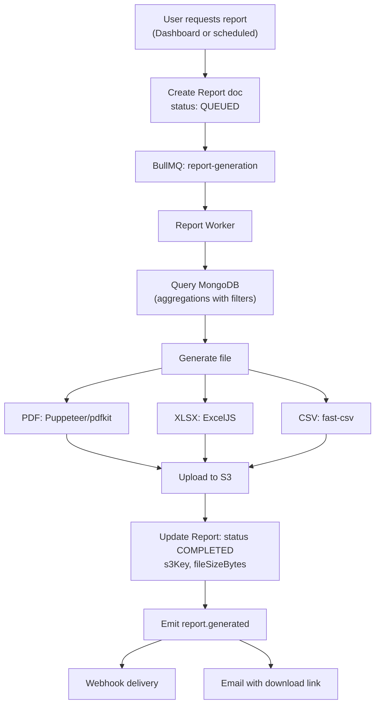

# Phase 19 — Reporting

## Report Types

| Type | Content | Formats |
|------|---------|---------|
| RISK_SUMMARY | Risk distribution, top risky pincodes, trend | PDF, XLSX, CSV |
| COURIER_PERFORMANCE | Courier comparison, success/RTO rates | PDF, XLSX, CSV |
| PINCODE_ANALYSIS | Pincode risk heatmap data, tier breakdown | PDF, XLSX, CSV |
| API_USAGE | Call volume, error rates, quota usage | PDF, XLSX, CSV |
| MODEL_PERFORMANCE | Metrics, confusion matrix, feature importance | PDF, XLSX |
| CUSTOM | User-defined filters and columns | CSV, XLSX |

## Reporting Workflow



## PDF Reports

```typescript
// backend/src/jobs/processors/reportGeneration.processor.ts
import PDFDocument from 'pdfkit';

async function generatePdfReport(report: IReport, data: ReportData): Promise<Buffer> {
  const doc = new PDFDocument({ margin: 50 });
  const chunks: Buffer[] = [];
  doc.on('data', (chunk) => chunks.push(chunk));

  // Header
  doc.fontSize(20).text('PredixRoute Report', { align: 'center' });
  doc.fontSize(12).text(`${report.name} — ${report.type}`, { align: 'center' });
  doc.text(`Period: ${formatDate(report.filters.dateFrom)} to ${formatDate(report.filters.dateTo)}`);
  doc.moveDown();

  // KPI Section
  doc.fontSize(16).text('Summary');
  doc.fontSize(11);
  for (const kpi of data.kpis) {
    doc.text(`${kpi.label}: ${kpi.value}`);
  }
  doc.moveDown();

  // Data Table
  doc.fontSize(16).text('Details');
  // ... render table rows

  // Footer
  doc.fontSize(8).text(`Generated by PredixRoute on ${new Date().toISOString()}`, 50, doc.page.height - 50);

  doc.end();
  return Buffer.concat(chunks);
}
```

## Excel Reports

```typescript
import ExcelJS from 'exceljs';

async function generateXlsxReport(report: IReport, data: ReportData): Promise<Buffer> {
  const workbook = new ExcelJS.Workbook();
  workbook.creator = 'PredixRoute';
  workbook.created = new Date();

  // Summary sheet
  const summary = workbook.addWorksheet('Summary');
  summary.columns = [
    { header: 'Metric', key: 'metric', width: 30 },
    { header: 'Value', key: 'value', width: 20 },
  ];
  data.kpis.forEach(kpi => summary.addRow({ metric: kpi.label, value: kpi.value }));

  // Detail sheet
  const detail = workbook.addWorksheet('Details');
  detail.columns = data.columns.map(c => ({ header: c.label, key: c.key, width: 15 }));
  data.rows.forEach(row => detail.addRow(row));

  // Style header row
  detail.getRow(1).font = { bold: true };
  detail.getRow(1).fill = { type: 'pattern', pattern: 'solid', fgColor: { argb: 'FF4F46E5' } };

  return Buffer.from(await workbook.xlsx.writeBuffer());
}
```

## CSV Reports

```typescript
import { format } from '@fast-csv/format';

async function generateCsvReport(data: ReportData): Promise<string> {
  return new Promise((resolve, reject) => {
    const chunks: string[] = [];
    const stream = format({ headers: data.columns.map(c => c.key) });
    stream.on('data', (chunk) => chunks.push(chunk.toString()));
    stream.on('end', () => resolve(chunks.join('')));
    stream.on('error', reject);
    data.rows.forEach(row => stream.write(row));
    stream.end();
  });
}
```

## Scheduled Reports

```typescript
// Cron job: every minute, check for due reports
async function processScheduledReports() {
  const dueReports = await reportRepo.findDue(new Date());
  for (const template of dueReports) {
    await reportQueue.add('generate', {
      organizationId: template.organizationId,
      type: template.type,
      format: template.format,
      filters: computeDateFilters(template.schedule),
      scheduledFrom: template.publicId,
    });
    await reportRepo.updateNextRun(template._id, computeNextRun(template.schedule.cron));
  }
}
```

**Cron examples:**
- `'0 9 * * 1'` — Every Monday at 9 AM
- `'0 8 1 * *'` — First of every month at 8 AM
- `'0 18 * * 1-5'` — Weekdays at 6 PM

## Email Reports

```typescript
async function sendReportEmail(report: IReport, organizationId: string) {
  const downloadUrl = await s3Service.getPresignedUrl(report.s3Key, 7 * 24 * 3600); // 7 days

  await emailService.send({
    to: org.billingEmail,
    subject: `PredixRoute Report: ${report.name}`,
    template: 'report-ready',
    data: {
      reportName: report.name,
      format: report.format,
      downloadUrl,
      expiresIn: '7 days',
    },
  });
}
```

## API Endpoints

| Method | Path | Description |
|--------|------|-------------|
| POST | `/dashboard/reports/generate` | Generate on-demand report |
| GET | `/dashboard/reports` | List reports |
| GET | `/dashboard/reports/:id/download` | Get presigned download URL |
| POST | `/dashboard/reports/schedules` | Create scheduled report |
| PUT | `/dashboard/reports/schedules/:id` | Update schedule |
| DELETE | `/dashboard/reports/:id` | Delete report + S3 object |

## S3 Storage

```
s3://predixroute-prod-assets/
  reports/
    {organizationId}/
      {reportId}/
        report.pdf
        report.xlsx
        report.csv
```

Lifecycle: auto-delete after 90 days (configurable per org).
