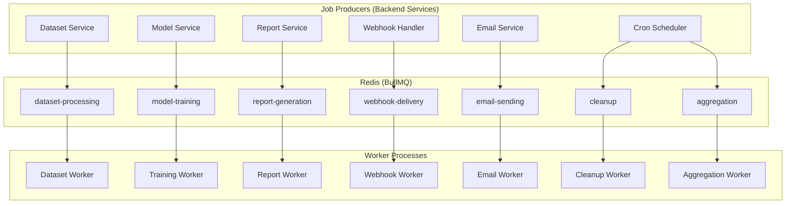

# Phase 21 — Background Jobs (BullMQ)

## Queue Architecture



## Queue Definitions

```typescript
// backend/src/jobs/queue.ts
import { Queue, Worker, QueueEvents } from 'bullmq';
import { redisConnection } from '../config/redis';

export const QUEUES = {
  DATASET_PROCESSING: 'dataset-processing',
  MODEL_TRAINING: 'model-training',
  REPORT_GENERATION: 'report-generation',
  WEBHOOK_DELIVERY: 'webhook-delivery',
  EMAIL_SENDING: 'email-sending',
  CLEANUP: 'cleanup',
  AGGREGATION: 'aggregation',
} as const;

export const datasetQueue = new Queue(QUEUES.DATASET_PROCESSING, {
  connection: redisConnection,
  defaultJobOptions: {
    attempts: 3,
    backoff: { type: 'exponential', delay: 5000 },
    removeOnComplete: { count: 100 },
    removeOnFail: { count: 500 },
  },
});

export const modelTrainingQueue = new Queue(QUEUES.MODEL_TRAINING, {
  connection: redisConnection,
  defaultJobOptions: {
    attempts: 1,  // no retry on training failure
    timeout: 3600000,  // 1 hour max
    removeOnComplete: { count: 50 },
    removeOnFail: { count: 100 },
  },
});

export const webhookQueue = new Queue(QUEUES.WEBHOOK_DELIVERY, {
  connection: redisConnection,
  defaultJobOptions: {
    attempts: 6,
    backoff: { type: 'custom' },
    removeOnComplete: { count: 200 },
    removeOnFail: { count: 1000 },
  },
});
```

## Job Processors

### 1. Dataset Processing

```typescript
// backend/src/jobs/processors/datasetProcessing.processor.ts
export async function processDataset(job: Job<DatasetProcessingPayload>) {
  const { datasetId, organizationId, s3Key } = job.data;

  await datasetRepo.updateStatus(datasetId, organizationId, 'PROCESSING');

  // Download from S3
  const csvBuffer = await s3Service.download(s3Key);
  const csvText = csvBuffer.toString('utf-8');

  // Validate & detect schema
  const validation = await validateCsv(csvText);
  if (!validation.isValid) {
    await datasetRepo.updateStatus(datasetId, organizationId, 'FAILED', validation.issues);
    return;
  }

  // Schema detection
  const schema = detectSchema(csvText);
  await datasetRepo.updateSchema(datasetId, organizationId, schema);

  // Data quality checks
  const qualityReport = runQualityChecks(csvText, schema);
  await datasetRepo.updateQualityReport(datasetId, organizationId, qualityReport);

  if (qualityReport.overallScore < 70) {
    await datasetRepo.updateStatus(datasetId, organizationId, 'FAILED');
    return;
  }

  // Process & upload cleaned CSV
  const processedCsv = processAndClean(csvText, schema);
  const processedKey = s3Key.replace('raw.csv', 'processed.csv');
  await s3Service.upload(processedKey, processedCsv);

  await datasetRepo.updateStatus(datasetId, organizationId, 'READY', null, {
    rowCount: qualityReport.rowCount,
    s3ProcessedKey: processedKey,
  });

  eventBus.emit('dataset.processed', { datasetId, organizationId, rowCount: qualityReport.rowCount });
}
```

### 2. Model Training

```typescript
export async function processModelTraining(job: Job<ModelTrainingPayload>) {
  const { modelId, organizationId, datasetId } = job.data;

  await modelRepo.updateStatus(modelId, organizationId, 'TRAINING');

  const dataset = await datasetRepo.findById(datasetId, organizationId);
  const processedCsv = await s3Service.download(dataset.s3ProcessedKey);

  // Call AI service
  const result = await aiOrchestrator.trainModel(organizationId, {
    datasetPath: processedCsv,
    modelId,
  });

  await modelRepo.updateMetrics(modelId, organizationId, result.metrics, 'STAGING');
  eventBus.emit('model.trained', { modelId, organizationId, version: result.version, metrics: result.metrics });
}
```

### 3. Report Generation

See Phase 19.

### 4. Webhook Delivery

See Phase 16.

### 5. Email Sending

```typescript
export async function processEmail(job: Job<EmailPayload>) {
  const { to, subject, template, data } = job.data;
  await emailService.send({ to, subject, template, data });
  await notificationLogRepo.updateStatus(job.data.logId, 'SENT');
}
```

### 6. Cleanup

```typescript
export async function processCleanup(job: Job) {
  // Delete expired refresh tokens from Redis
  // Purge soft-deleted documents past retention period
  // Remove expired S3 report files
  // Trim audit logs past 90 days (TTL handles this)
  // Archive old ApiUsage daily records (> 90 days)

  const retentionDays = 30;
  const cutoff = new Date(Date.now() - retentionDays * 86400000);

  await shipmentRepo.hardDeleteBefore(cutoff);
  await reportRepo.deleteExpiredS3Objects();
  logger.info('Cleanup job completed');
}
```

## Cron Schedules

```typescript
// backend/src/jobs/cron.ts
import { Queue } from 'bullmq';

export async function setupCronJobs() {
  // Nightly pincode/courier aggregation — 02:00 IST
  await aggregationQueue.add('pincode-courier-aggregation', {}, {
    repeat: { pattern: '0 2 * * *', tz: 'Asia/Kolkata' },
  });

  // Scheduled report check — every minute
  await reportQueue.add('check-scheduled-reports', {}, {
    repeat: { pattern: '* * * * *' },
  });

  // Cleanup — daily at 03:00 IST
  await cleanupQueue.add('daily-cleanup', {}, {
    repeat: { pattern: '0 3 * * *', tz: 'Asia/Kolkata' },
  });

  // API usage snapshot — every hour
  await aggregationQueue.add('api-usage-snapshot', {}, {
    repeat: { pattern: '0 * * * *' },
  });
}
```

## Worker Bootstrap

```typescript
// backend/src/jobs/worker.ts
export function startWorkers() {
  new Worker(QUEUES.DATASET_PROCESSING, processDataset, {
    connection: redisConnection,
    concurrency: 2,
  });

  new Worker(QUEUES.MODEL_TRAINING, processModelTraining, {
    connection: redisConnection,
    concurrency: 1,  // CPU-intensive
  });

  new Worker(QUEUES.WEBHOOK_DELIVERY, processWebhook, {
    connection: redisConnection,
    concurrency: 5,
  });

  new Worker(QUEUES.EMAIL_SENDING, processEmail, {
    connection: redisConnection,
    concurrency: 3,
  });

  new Worker(QUEUES.REPORT_GENERATION, processReport, {
    connection: redisConnection,
    concurrency: 2,
  });

  new Worker(QUEUES.CLEANUP, processCleanup, {
    connection: redisConnection,
    concurrency: 1,
  });

  new Worker(QUEUES.AGGREGATION, processAggregation, {
    connection: redisConnection,
    concurrency: 1,
  });

  logger.info('All BullMQ workers started');
}
```

## Monitoring

- BullMQ events logged to Winston
- Queue depth metrics exported to CloudWatch
- Alert if queue depth > 1000 for > 5 minutes
- Failed jobs dashboard in admin panel
