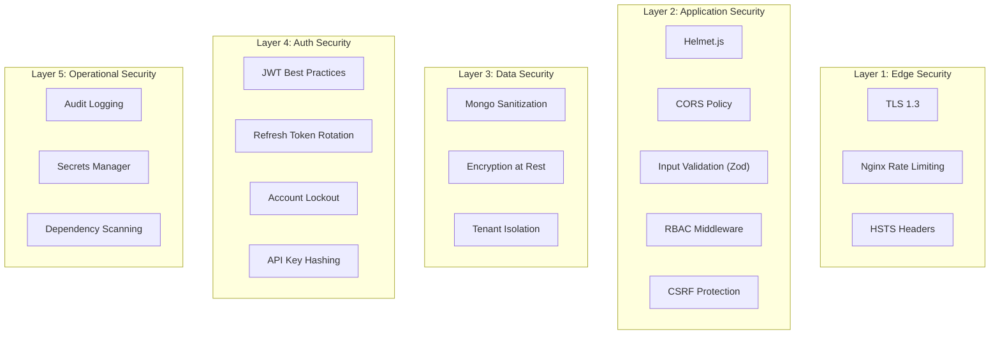

# Phase 22 — Security Architecture

## Security Layers



## Implementation Details

### Helmet.js

```typescript
import helmet from 'helmet';

app.use(helmet({
  contentSecurityPolicy: {
    directives: {
      defaultSrc: ["'self'"],
      scriptSrc: ["'self'"],
      styleSrc: ["'self'", "'unsafe-inline'"],
      imgSrc: ["'self'", 'data:', 'https:'],
      connectSrc: ["'self'", config.apiBaseUrl],
      frameSrc: ["'none'"],
      objectSrc: ["'none'"],
    },
  },
  crossOriginEmbedderPolicy: false,
  hsts: { maxAge: 31536000, includeSubDomains: true, preload: true },
}));
```

### Rate Limiting

```typescript
import rateLimit from 'express-rate-limit';
import RedisStore from 'rate-limit-redis';

const publicApiLimiter = rateLimit({
  store: new RedisStore({ sendCommand: (...args) => redis.call(...args) }),
  windowMs: 60 * 1000,
  max: (req) => req.apiKey?.rateLimitOverride ?? req.plan?.rateLimitPerMinute ?? 60,
  keyGenerator: (req) => req.tenant?.organizationId ?? req.ip,
  handler: (req, res) => {
    res.status(429).json({
      success: false,
      error: { code: 'RATE_LIMIT_EXCEEDED', message: 'Too many requests' },
    });
  },
  standardHeaders: true,
  legacyHeaders: false,
});
```

### CORS

```typescript
const corsOptions: CorsOptions = {
  origin: (origin, callback) => {
    const allowed = [
      config.frontendUrl,
      'https://app.predixroute.com',
    ];
    if (!origin || allowed.includes(origin)) {
      callback(null, true);
    } else {
      callback(new ApiError(403, 'CORS_DENIED', 'Origin not allowed'));
    }
  },
  credentials: true,
  methods: ['GET', 'POST', 'PUT', 'DELETE', 'PATCH'],
  allowedHeaders: ['Content-Type', 'Authorization', 'X-API-Key', 'X-CSRF-Token'],
  maxAge: 86400,
};
```

### Input Validation

- All request bodies validated via Zod schemas before reaching controllers
- MongoDB query parameters sanitized via `express-mongo-sanitize`
- File uploads validated: MIME type, extension, size limits
- Pincode fields regex-validated: `/^\d{6}$/`

### Mongo Injection Protection

```typescript
import mongoSanitize from 'express-mongo-sanitize';

app.use(mongoSanitize({
  replaceWith: '_',
  onSanitize: ({ req, key }) => {
    logger.warn({ requestId: req.requestId, key }, 'Mongo injection attempt sanitized');
  },
}));
```

### XSS Protection

- React auto-escapes JSX output
- `dangerouslySetInnerHTML` prohibited (ESLint rule)
- API responses: `Content-Type: application/json` (no HTML)
- User-generated content sanitized via DOMPurify if rendered

### CSRF Protection

```typescript
// Dashboard routes only (not public API)
import csrf from 'csurf';

const csrfProtection = csrf({
  cookie: { httpOnly: true, secure: true, sameSite: 'strict' },
});

router.use('/dashboard', csrfProtection);

// Frontend reads CSRF token from cookie and sends in header
// X-CSRF-Token: {token}
```

### JWT Security

| Practice | Implementation |
|----------|---------------|
| Algorithm | RS256 (production) or HS256 (dev) |
| Access token lifetime | 15 minutes |
| Refresh token lifetime | 7 days |
| Token rotation | On every refresh |
| Reuse detection | Revoke entire family |
| Revocation | Redis blacklist by jti |
| Payload minimization | No sensitive data in JWT |

### Secret Management

```
Development:  .env file (gitignored)
Staging:      AWS Secrets Manager
Production:   AWS Secrets Manager + IAM role

Secrets:
  JWT_ACCESS_SECRET
  JWT_REFRESH_SECRET
  MONGODB_URI
  REDIS_URL
  AI_SERVICE_INTERNAL_TOKEN
  AWS_ACCESS_KEY_ID / SECRET (via IAM role, not stored)
  SENDGRID_API_KEY
  S3_BUCKET_NAME
```

### Audit Logging

Every state-changing operation logged:
- User login/logout/failed attempts
- API key create/revoke
- Model activate/rollback
- Dataset upload/delete
- Webhook create/update/delete
- Role changes
- Organization settings changes
- Super admin cross-tenant access

### Dependency Scanning

```yaml
# .github/workflows/ci-backend.yml
- name: Security audit
  run: npm audit --audit-level=high

- name: Snyk scan
  uses: snyk/actions/node@master
  env:
    SNYK_TOKEN: ${{ secrets.SNYK_TOKEN }}
```

## Security Headers (Nginx)

```nginx
add_header X-Frame-Options "SAMEORIGIN" always;
add_header X-Content-Type-Options "nosniff" always;
add_header X-XSS-Protection "1; mode=block" always;
add_header Referrer-Policy "strict-origin-when-cross-origin" always;
add_header Permissions-Policy "camera=(), microphone=(), geolocation=()" always;
add_header Strict-Transport-Security "max-age=31536000; includeSubDomains; preload" always;
```

## Threat Model Summary

| Threat | Mitigation |
|--------|-----------|
| API key theft | Hash storage, instant revoke, scope limitation |
| JWT theft | httpOnly cookies, short lifetime, rotation |
| Tenant data leak | Repository-level orgId injection, no shared queries |
| DDoS | Nginx rate limit + ALB + CloudWatch auto-scaling |
| SQL/NoSQL injection | Zod validation + mongo-sanitize |
| XSS | React escaping + CSP headers |
| CSRF | SameSite cookies + CSRF tokens |
| AI service exposure | Private subnet, internal token, no public DNS |
| Data breach | Encryption at rest/transit, audit logs, minimal PII |
