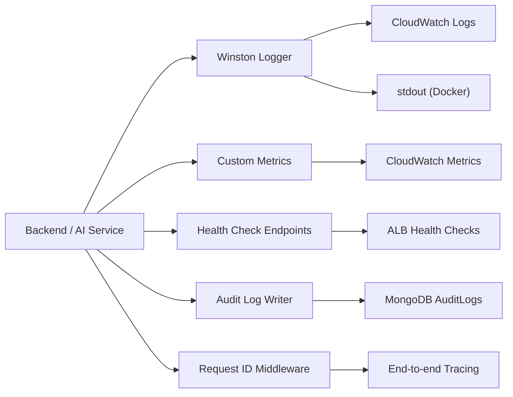

# Phase 24 — Observability

## Architecture



## Winston Logging

```typescript
// backend/src/utils/logger.ts
import winston from 'winston';

const logger = winston.createLogger({
  level: process.env.LOG_LEVEL ?? 'info',
  format: winston.format.combine(
    winston.format.timestamp(),
    winston.format.errors({ stack: true }),
    winston.format.json(),
  ),
  defaultMeta: { service: 'predixroute-backend' },
  transports: [
    new winston.transports.Console({
      format: process.env.NODE_ENV === 'development'
        ? winston.format.combine(winston.format.colorize(), winston.format.simple())
        : winston.format.json(),
    }),
  ],
});

export default logger;
```

### Log Levels

| Level | Usage |
|-------|-------|
| error | Unhandled exceptions, AI service failures, DB connection errors |
| warn | Rate limit hits, validation failures, deprecated API usage |
| info | Request completed, job started/completed, model activated |
| http | Request/response details (method, path, status, duration) |
| debug | Feature pipeline details, cache hits/misses |

### Structured Log Format

```json
{
  "timestamp": "2026-06-10T14:30:00.000Z",
  "level": "info",
  "service": "predixroute-backend",
  "requestId": "req_abc123",
  "organizationId": "org_xyz",
  "message": "Risk evaluation completed",
  "duration": 145,
  "predictionId": "prd_k7x9",
  "riskLevel": "LOW"
}
```

### PII Redaction

```typescript
const redactFormat = winston.format((info) => {
  if (info.email) info.email = maskEmail(info.email);
  if (info.password) info.password = '[REDACTED]';
  if (info.apiKey) info.apiKey = info.apiKey.substring(0, 12) + '...';
  return info;
});
```

## Health Checks

### Backend: GET /api/v1/health

```typescript
export async function healthCheck(): Promise<HealthStatus> {
  const checks = await Promise.allSettled([
    checkMongoDB(),
    checkRedis(),
    checkAiService(),
  ]);

  const services = {
    database: checks[0].status === 'fulfilled' ? 'healthy' : 'unhealthy',
    redis: checks[1].status === 'fulfilled' ? 'healthy' : 'unhealthy',
    aiService: checks[2].status === 'fulfilled' ? 'healthy' : 'degraded',
  };

  const overall = Object.values(services).every(s => s === 'healthy')
    ? 'healthy'
    : Object.values(services).some(s => s === 'unhealthy')
      ? 'unhealthy'
      : 'degraded';

  return { status: overall, version: packageJson.version, services, timestamp: new Date().toISOString() };
}
```

### AI Service: GET /internal/v1/health

```python
@app.get("/internal/v1/health")
async def health():
    model_loaded = registry_service.has_active_model("platform", "RISK_PREDICTION")
    return {
        "status": "healthy" if model_loaded else "degraded",
        "models_loaded": registry_service.cache_size(),
        "uptime_seconds": time.time() - START_TIME,
    }
```

## Metrics (CloudWatch)

| Metric | Namespace | Dimensions |
|--------|-----------|------------|
| RequestCount | PredixRoute/API | Endpoint, Method, StatusCode |
| RequestLatency | PredixRoute/API | Endpoint, Percentile |
| PredictionCount | PredixRoute/ML | OrganizationId, RiskLevel |
| PredictionLatency | PredixRoute/ML | Percentile |
| QueueDepth | PredixRoute/Jobs | QueueName |
| JobDuration | PredixRoute/Jobs | QueueName, Status |
| CacheHitRate | PredixRoute/Cache | CacheType |
| ActiveConnections | PredixRoute/Infra | Service |
| ErrorRate | PredixRoute/API | Service, ErrorCode |

```typescript
// Metric emission middleware
app.use((req, res, next) => {
  const start = Date.now();
  res.on('finish', () => {
    const duration = Date.now() - start;
    cloudwatch.putMetric({
      namespace: 'PredixRoute/API',
      metricName: 'RequestLatency',
      value: duration,
      unit: 'Milliseconds',
      dimensions: [
        { Name: 'Endpoint', Value: req.route?.path ?? req.path },
        { Name: 'Method', Value: req.method },
        { Name: 'StatusCode', Value: String(res.statusCode) },
      ],
    });
  });
  next();
});
```

## Request Tracking

```typescript
// backend/src/middleware/requestId.middleware.ts
import { nanoid } from 'nanoid';

export function requestIdMiddleware(req: Request, res: Response, next: NextFunction) {
  req.requestId = (req.headers['x-request-id'] as string) ?? `req_${nanoid(12)}`;
  res.setHeader('X-Request-Id', req.requestId);
  next();
}
```

Request ID propagated to:
- All log entries
- AI service calls (`X-Request-Id` header)
- Audit log entries
- API responses
- Webhook delivery logs

## Error Tracking

```typescript
// Unhandled rejection / exception handlers
process.on('unhandledRejection', (reason) => {
  logger.error({ err: reason }, 'Unhandled promise rejection');
});

process.on('uncaughtException', (error) => {
  logger.error({ err: error.message, stack: error.stack }, 'Uncaught exception');
  process.exit(1);  // let process manager restart
});
```

Future integration: Sentry SDK for error aggregation and alerting.

## CloudWatch Alarms

| Alarm | Condition | Action |
|-------|-----------|--------|
| High Error Rate | 5xx > 1% for 5 min | SNS → PagerDuty |
| High Latency | p95 > 500ms for 5 min | SNS → Slack |
| AI Service Down | health check fails 3x | SNS → PagerDuty |
| Queue Backlog | depth > 1000 for 10 min | SNS → Slack |
| Disk Usage | > 80% | SNS → Email |
| MongoDB Connections | > 80% pool | SNS → Slack |

## Audit Logs

See Phase 3 (AuditLogs collection). Written via middleware on state-changing operations:

```typescript
export function auditLogMiddleware(action: string, resource: string) {
  return async (req: Request, res: Response, next: NextFunction) => {
    const originalJson = res.json.bind(res);
    res.json = (body) => {
      if (res.statusCode < 400) {
        auditLogRepo.create({
          organizationId: req.tenant?.organizationId ?? req.user?.organizationId,
          userId: req.user?.userId,
          apiKeyId: req.apiKey?._id,
          action,
          resource,
          resourceId: body?.data?.publicId ?? req.params.id,
          ip: req.ip,
          userAgent: req.headers['user-agent'],
          requestId: req.requestId,
        });
      }
      return originalJson(body);
    };
    next();
  };
}
```
